# Entity Model

Datenmodell des MVP-Schnitts. Grundlage: [`requirements.md`](requirements.md) und
[`use_cases/`](use_cases/).

**Datentypen:** Das Modell bildet ein PostgreSQL-Schema ab. `UUID` entspricht `uuid`, `JSON`
entspricht `jsonb`, `DateTime` entspricht `timestamptz`, `String` entspricht `text`. Entitäts- und
Attributnamen sind englisch, weil sie unverändert in Schema und Code auftreten.

**Abgrenzung:** Rechnungsdaten leben im eigenständigen Dienst «myclub Billing»; in diesem Modell
existiert nur der lesende Spiegel `INVOICE_REF`. Die als `Deferred` geführten Anforderungen
(Badges, Level, Challenges, Rewards, Funktionärsämter, Meisterschaft, Eltern und Kinder) sind hier
noch nicht modelliert.

## Entity Relationship Diagram

```mermaid
erDiagram
    USER_ACCOUNT ||--o{ CLUB_MEMBER : "ist"
    USER_ACCOUNT ||--o{ JOIN_REQUEST : "stellt"
    USER_ACCOUNT ||--o{ PUSH_TOKEN : "registriert"
    USER_ACCOUNT ||--o{ NOTIFICATION : "empfängt"
    USER_ACCOUNT ||--o{ NOTIFICATION_PREF : "konfiguriert"

    CLUB ||--o{ CLUB_MEMBER : "hat"
    CLUB ||--o{ TEAM : "gliedert sich in"
    CLUB ||--o{ INVITE : "gibt aus"
    CLUB ||--o{ JOIN_REQUEST : "erhält"
    CLUB ||--o{ EVENT_SERIES : "führt"
    CLUB ||--o{ EVENT : "veranstaltet"
    CLUB ||--o{ POINT_RULE : "definiert"
    CLUB ||--o{ POINT_TRANSACTION : "verbucht"
    CLUB ||--o{ TASK : "schreibt aus"
    CLUB ||--o{ NEWS : "publiziert"
    CLUB ||--o{ HEALTH_SIGNAL : "erzeugt"
    CLUB ||--o{ HEALTH_ALERT_ROUTING : "konfiguriert"
    CLUB ||--o{ CLUB_MESSAGE_LOG : "protokolliert"
    CLUB ||--o{ VOICE_NOTE : "sammelt"
    CLUB ||--o{ MEETING_INPUT : "behandelt"
    CLUB ||--o{ CHECKIN_PROMPT : "stellt"
    CLUB ||--o{ CHECKIN_RESPONSE : "sammelt"
    CLUB ||--o{ INVOICE_REF : "spiegelt"
    CLUB ||--o{ FEDERATION_CONNECTION : "verbindet"

    TEAM ||--o{ TEAM_MEMBER : "umfasst"
    TEAM ||--o{ EVENT : "plant"
    TEAM ||--o{ NEWS : "informiert"
    TEAM ||--o{ INVITE : "adressiert"
    TEAM ||--o{ JOIN_REQUEST : "betrifft"
    TEAM ||--o{ HEALTH_SIGNAL : "verortet"

    CLUB_MEMBER ||--o{ TEAM_MEMBER : "gehört zu"
    CLUB_MEMBER ||--o{ ATTENDANCE : "nimmt teil an"
    CLUB_MEMBER ||--o{ POINT_TRANSACTION : "erhält"
    CLUB_MEMBER ||--o{ TASK_ASSIGNMENT : "übernimmt"
    CLUB_MEMBER ||--o| MEMBER_CONTRIBUTION_PROFILE : "beschreibt sich in"
    CLUB_MEMBER ||--o{ HEALTH_SIGNAL : "betrifft"
    CLUB_MEMBER ||--o{ VOICE_NOTE : "verfasst"
    CLUB_MEMBER ||--o{ MEETING_INPUT : "reicht ein"
    CLUB_MEMBER ||--o{ CHECKIN_RESPONSE : "beantwortet"
    CLUB_MEMBER ||--o{ INVOICE_REF : "schuldet"

    EVENT_SERIES ||--o{ EVENT : "erzeugt"
    EVENT ||--o{ EVENT_SHIFT : "gliedert sich in"
    EVENT ||--o{ ATTENDANCE : "erfasst"
    EVENT ||--o{ CHECKIN_RESPONSE : "löst aus"
    EVENT ||--o{ MEETING_INPUT : "behandelt"
    EVENT_SHIFT ||--o{ ATTENDANCE : "besetzt durch"

    POINT_RULE ||--o{ POINT_TRANSACTION : "bewertet"
    TASK ||--o{ TASK_ASSIGNMENT : "wird übernommen in"
    TASK ||--o| VOICE_NOTE : "entsteht aus"
    TASK ||--o| MEETING_INPUT : "folgt aus"

    NEWS ||--o| MEETING_INPUT : "veröffentlicht"
    VOICE_NOTE ||--o| MEETING_INPUT : "wird zu"
    VOICE_NOTE ||--o| CHECKIN_RESPONSE : "ergänzt"
    CHECKIN_PROMPT ||--o{ CHECKIN_RESPONSE : "wird beantwortet durch"
```

---

## Entitäten

### USER_ACCOUNT

Das plattformweite Anmeldekonto einer Person, unabhängig von der Vereinszugehörigkeit.

| Attribute      | Description                                        | Data Type | Length/Precision | Validation Rules        |
| -------------- | -------------------------------------------------- | --------- | ---------------- | ----------------------- |
| id             | Eindeutige Kennung des Kontos                      | UUID      | 36               | Primary Key, Generated  |
| email          | Anmeldeadresse für Magic Link und Passwort         | String    | 320              | Not Null, Format: Email |
| email_verified | Zeitpunkt der Bestätigung der Adresse              | DateTime  | -                | Optional                |
| locale         | Bevorzugte Sprache der Oberfläche                  | String    | 5                | Not Null, Values: de, fr, it, en |
| created_at     | Zeitpunkt der Kontoerstellung                      | DateTime  | -                | Not Null                |

**Constraints:** Das Konto wird von Supabase Auth verwaltet. Eine Löschung entfernt das Konto und anonymisiert alle daran hängenden Mitgliedschaften.

### CLUB

Ein Verein als Mandant der Plattform; jede fachliche Entität hängt an genau einem Verein.

| Attribute           | Description                                                    | Data Type | Length/Precision | Validation Rules                                                    |
| ------------------- | -------------------------------------------------------------- | --------- | ---------------- | ------------------------------------------------------------------- |
| id                  | Eindeutige Kennung des Vereins                                 | UUID      | 36               | Primary Key, Generated                                              |
| name                | Name des Vereins                                               | String    | 120              | Not Null                                                            |
| slug                | Kurzname für Links und Einladungen                             | String    | 60               | Not Null, Unique                                                    |
| club_kind           | Vereinsart, steuert ausschliesslich Vorlagen                   | String    | 20               | Not Null, Values: sport, music, culture, youth, neighborhood, other |
| season_start        | Kalendertag, an dem die Vereinssaison beginnt                  | Date      | -                | Not Null                                                            |
| settings            | Erscheinungsbild, Terminlabels, aktive Module, Schwellenwerte  | JSON      | -                | Not Null                                                            |
| dna                 | Warum, Werte, Tonalität, Traditionen und eigene Begriffe       | JSON      | -                | Optional                                                            |
| subscription_status | Zustand des Abonnements                                        | String    | 20               | Not Null, Values: active, trial, suspended                          |
| created_at          | Zeitpunkt der Gründung                                         | DateTime  | -                | Not Null                                                            |

**Constraints:** Ein Verein hat zu jedem Zeitpunkt mindestens ein CLUB_MEMBER mit der Rolle admin.

### CLUB_MEMBER

Die Mitgliedschaft einer Person in einem Verein samt Rolle und Sichtbarkeitsentscheiden.

| Attribute          | Description                                              | Data Type | Length/Precision | Validation Rules                             |
| ------------------ | -------------------------------------------------------- | --------- | ---------------- | -------------------------------------------- |
| id                 | Eindeutige Kennung der Mitgliedschaft                    | UUID      | 36               | Primary Key, Generated                       |
| club_id            | Verein der Mitgliedschaft                                | UUID      | 36               | Not Null, Foreign Key (CLUB.id)              |
| user_id            | Anmeldekonto der Person                                  | UUID      | 36               | Optional, Foreign Key (USER_ACCOUNT.id)      |
| display_name       | Im Verein angezeigter Name                               | String    | 80               | Not Null                                     |
| avatar_url         | Verweis auf das Profilbild                               | String    | 500              | Optional                                     |
| role               | Rolle im Verein                                          | String    | 20               | Not Null, Values: member, trainer, admin, superadmin |
| status             | Zustand der Mitgliedschaft                               | String    | 20               | Not Null, Values: active, passive, honorary, left |
| member_since       | Eintrittsdatum, Grundlage der Treue-Dimension            | Date      | -                | Not Null                                     |
| leaderboard_opt_in | Zustimmung zur Anzeige in Ranglisten                     | Boolean   | 1                | Not Null                                     |
| health_opt_out     | Abbestellung individueller Fürsorge-Hinweise             | Boolean   | 1                | Not Null                                     |
| is_minor           | Kennzeichen für Mitglieder unter 16 Jahren               | Boolean   | 1                | Not Null                                     |
| privacy            | Sichtbarkeit einzelner Kontaktangaben                    | JSON      | -                | Not Null                                     |

**Constraints:** Je Verein und Anmeldekonto existiert höchstens eine Mitgliedschaft. Ein Konto ohne `user_id` ist eine vom Verein geführte Person ohne eigenen Zugang.

### TEAM

Eine Gruppe innerhalb eines Vereins, an der Termine, Ranglisten und Reichweiten hängen.

| Attribute | Description                    | Data Type | Length/Precision | Validation Rules                |
| --------- | ------------------------------ | --------- | ---------------- | ------------------------------- |
| id        | Eindeutige Kennung des Teams   | UUID      | 36               | Primary Key, Generated          |
| club_id   | Verein des Teams               | UUID      | 36               | Not Null, Foreign Key (CLUB.id) |
| name      | Bezeichnung des Teams          | String    | 80               | Not Null                        |
| sort      | Reihenfolge in Auswahllisten   | Integer   | 10               | Optional                        |

**Constraints:** Der Teamname ist innerhalb eines Vereins eindeutig.

### TEAM_MEMBER

Die Zuordnung eines Mitglieds zu einem Team mit seiner dortigen Funktion.

| Attribute | Description                        | Data Type | Length/Precision | Validation Rules                        |
| --------- | ---------------------------------- | --------- | ---------------- | --------------------------------------- |
| team_id   | Team der Zuordnung                 | UUID      | 36               | Not Null, Foreign Key (TEAM.id)         |
| member_id | Zugeordnetes Mitglied              | UUID      | 36               | Not Null, Foreign Key (CLUB_MEMBER.id)  |
| role      | Funktion im Team                   | String    | 20               | Not Null, Values: player, trainer, staff |
| joined_at | Zeitpunkt der Zuordnung            | DateTime  | -                | Not Null                                |

**Constraints:** Primärschlüssel ist die Kombination aus `team_id` und `member_id`. Team und Mitglied gehören demselben Verein an. Die Reichweite einer Trainer:in ergibt sich aus einer Zuordnung mit `role = trainer`.

### INVITE

Ein ausgegebener Einladungslink mit Geltungsbereich, Rolle und Ablauf.

| Attribute     | Description                                    | Data Type | Length/Precision | Validation Rules                       |
| ------------- | ---------------------------------------------- | --------- | ---------------- | -------------------------------------- |
| id            | Eindeutige Kennung der Einladung               | UUID      | 36               | Primary Key, Generated                 |
| club_id       | Verein, in den eingeladen wird                 | UUID      | 36               | Not Null, Foreign Key (CLUB.id)        |
| team_id       | Team, in das eingeladen wird                   | UUID      | 36               | Optional, Foreign Key (TEAM.id)        |
| code          | Nicht erratbarer Code des Einladungslinks      | String    | 64               | Not Null, Unique                       |
| grant_role    | Rolle, die eingeladene Personen erhalten       | String    | 20               | Not Null, Values: member, trainer, admin |
| expires_at    | Zeitpunkt, ab dem die Einladung ungültig ist   | DateTime  | -                | Not Null                               |
| max_uses      | Höchstzahl möglicher Einlösungen               | Integer   | 10               | Optional, Min: 1                       |
| used_count    | Bisherige Anzahl Einlösungen                   | Integer   | 10               | Not Null, Min: 0                       |
| revoked_at    | Zeitpunkt des Widerrufs                        | DateTime  | -                | Optional                               |
| created_by    | Ausstellende Person                            | UUID      | 36               | Not Null, Foreign Key (CLUB_MEMBER.id) |

**Constraints:** Eine Einladung ist einlösbar, solange `revoked_at` leer ist, `expires_at` in der Zukunft liegt und `used_count` kleiner als `max_uses` ist. `grant_role` darf die Rolle der ausstellenden Person nicht übersteigen.

### JOIN_REQUEST

Eine Beitritts-Anfrage ohne Einladung, über die der Vorstand entscheidet.

| Attribute   | Description                              | Data Type | Length/Precision | Validation Rules                            |
| ----------- | ---------------------------------------- | --------- | ---------------- | ------------------------------------------- |
| id          | Eindeutige Kennung der Anfrage           | UUID      | 36               | Primary Key, Generated                      |
| club_id     | Verein, an den sich die Anfrage richtet  | UUID      | 36               | Not Null, Foreign Key (CLUB.id)             |
| team_id     | Gewünschtes Team                         | UUID      | 36               | Optional, Foreign Key (TEAM.id)             |
| user_id     | Anfragendes Anmeldekonto                 | UUID      | 36               | Not Null, Foreign Key (USER_ACCOUNT.id)     |
| status      | Bearbeitungsstand der Anfrage            | String    | 20               | Not Null, Values: pending, approved, rejected, withdrawn |
| decided_by  | Entscheidende Person                     | UUID      | 36               | Optional, Foreign Key (CLUB_MEMBER.id)      |
| decided_at  | Zeitpunkt des Entscheids                 | DateTime  | -                | Optional                                    |
| created_at  | Zeitpunkt der Anfrage                    | DateTime  | -                | Not Null                                    |

**Constraints:** Je Verein und Anmeldekonto besteht höchstens eine offene Anfrage. Ein Endstatus verlangt `decided_by` und `decided_at`.

### EVENT_SERIES

Die Wiederholungsregel, aus der eine Reihe gleichartiger Termine erzeugt wird.

| Attribute | Description                                   | Data Type | Length/Precision | Validation Rules                |
| --------- | --------------------------------------------- | --------- | ---------------- | ------------------------------- |
| id        | Eindeutige Kennung der Serie                  | UUID      | 36               | Primary Key, Generated          |
| club_id   | Verein der Serie                              | UUID      | 36               | Not Null, Foreign Key (CLUB.id) |
| team_id   | Team der Serie                                | UUID      | 36               | Optional, Foreign Key (TEAM.id) |
| rule      | Rhythmus, Wochentag, Uhrzeit und Enddatum     | JSON      | -                | Not Null                        |
| created_at| Zeitpunkt der Anlage                          | DateTime  | -                | Not Null                        |

### EVENT

Ein Termin des Vereins: Training, Wettkampf, Anlass, Helfer-Event, Sitzung oder Generalversammlung.

| Attribute        | Description                                            | Data Type | Length/Precision | Validation Rules                                                        |
| ---------------- | ------------------------------------------------------ | --------- | ---------------- | ----------------------------------------------------------------------- |
| id               | Eindeutige Kennung des Termins                         | UUID      | 36               | Primary Key, Generated                                                  |
| club_id          | Verein des Termins                                     | UUID      | 36               | Not Null, Foreign Key (CLUB.id)                                         |
| team_id          | Team des Termins; leer bedeutet Vereinstermin          | UUID      | 36               | Optional, Foreign Key (TEAM.id)                                         |
| series_id        | Serie, aus der der Termin stammt                       | UUID      | 36               | Optional, Foreign Key (EVENT_SERIES.id)                                 |
| type             | Technischer Termintyp; die Bezeichnung ist ein Label   | String    | 20               | Not Null, Values: training, match, cup, tournament, gv, social, helper, meeting |
| title            | Titel des Termins                                      | String    | 160              | Not Null                                                                |
| why              | Sinnzusammenhang des Aufrufs                           | String    | 500              | Optional                                                                |
| starts_at        | Beginn des Termins                                     | DateTime  | -                | Not Null                                                                |
| ends_at          | Ende des Termins                                       | DateTime  | -                | Optional                                                                |
| location         | Ortsangabe in Textform                                 | String    | 200              | Optional                                                                |
| capacity_needed  | Benötigte Anzahl Teilnehmender                         | Integer   | 10               | Optional, Min: 1                                                        |
| point_rule_code  | Regel, die eine Teilnahme bewertet                     | String    | 60               | Optional                                                                |
| audience_role_ids| Ämter, an die eine Sitzungseinladung geht              | JSON      | -                | Optional                                                                |
| cancelled_at     | Zeitpunkt der Absage                                   | DateTime  | -                | Optional                                                                |
| cancelled_reason | Begründung der Absage                                  | String    | 500              | Optional                                                                |
| is_sample        | Kennzeichen als Beispielinhalt der Erstbefüllung        | Boolean   | 1                | Not Null                                                                |
| created_by       | Erfassende Person                                      | UUID      | 36               | Not Null, Foreign Key (CLUB_MEMBER.id)                                  |

**Constraints:** `ends_at` liegt nach `starts_at`. Für die Typen helper, gv und social ist `why` nicht leer. Eine Absage verlangt `cancelled_at` und `cancelled_reason`.

### EVENT_QR_TOKEN

Das Check-in-Token eines Termins. Eigene Entität und nicht ein Attribut von
EVENT, weil es ein **Geheimnis** ist: Als Spalte in `events` liesse es jede
Lesepolicy auf den Termin mitlesen, und ein Code, den alle Mitglieder kennen,
beweist keine Anwesenheit mehr (UC-014, BR-055/BR-056).

| Attribut | Beschreibung                        | Datentyp | Länge | Constraints                                   |
| -------- | ----------------------------------- | -------- | ----- | --------------------------------------------- |
| event_id | Termin, zu dem der Code gehört       | UUID     | —     | PK, FK → EVENT, On Delete Cascade             |
| token    | Zufälliges Token für den Check-in    | String   | 32    | Not Null, Unique                              |

Sichtbar ausschliesslich für Trainer:innen und den Vorstand des Vereins.
Vergeben wird es beim Anlegen des Termins durch einen Trigger.

### EVENT_SHIFT

Ein Zeitfenster innerhalb eines Helfer-Events mit eigenem Personalbedarf und Punktwert.

| Attribute       | Description                              | Data Type | Length/Precision | Validation Rules                 |
| --------------- | ---------------------------------------- | --------- | ---------------- | -------------------------------- |
| id              | Eindeutige Kennung der Schicht           | UUID      | 36               | Primary Key, Generated           |
| event_id        | Helfer-Event der Schicht                 | UUID      | 36               | Not Null, Foreign Key (EVENT.id) |
| title           | Bezeichnung der Schicht                  | String    | 160              | Not Null                         |
| starts_at       | Beginn der Schicht                       | DateTime  | -                | Not Null                         |
| ends_at         | Ende der Schicht                         | DateTime  | -                | Not Null                         |
| needed          | Benötigte Anzahl Helfer:innen            | Integer   | 10               | Not Null, Min: 1                 |
| point_rule_code | Regel, die den Einsatz bewertet          | String    | 60               | Not Null                         |

**Constraints:** `ends_at` liegt nach `starts_at`. Die Zahl der Einträge mit Status registered oder present überschreitet `needed` nicht.

### ATTENDANCE

Die Antwort und die tatsächliche Anwesenheit eines Mitglieds an einem Termin oder in einer Schicht.

| Attribute     | Description                                        | Data Type | Length/Precision | Validation Rules                                                     |
| ------------- | -------------------------------------------------- | --------- | ---------------- | -------------------------------------------------------------------- |
| event_id      | Termin der Erfassung                               | UUID      | 36               | Not Null, Foreign Key (EVENT.id)                                     |
| member_id     | Betroffenes Mitglied                               | UUID      | 36               | Not Null, Foreign Key (CLUB_MEMBER.id)                               |
| shift_id      | Schicht, sofern es ein Helfer-Event ist            | UUID      | 36               | Optional, Foreign Key (EVENT_SHIFT.id)                               |
| status        | Antwort oder Anwesenheit                           | String    | 20               | Not Null, Values: registered, present, excused, absent, substitute   |
| decline_reason| Grund einer Absage                                 | String    | 300              | Optional                                                             |
| responded_at  | Zeitpunkt der Zu- oder Absage                      | DateTime  | -                | Optional                                                             |
| checked_in_at | Zeitpunkt des Check-ins                            | DateTime  | -                | Optional                                                             |
| confirmed_by  | Person, die die Anwesenheit bestätigt hat          | UUID      | 36               | Optional, Foreign Key (CLUB_MEMBER.id)                               |

**Constraints:** Primärschlüssel ist die Kombination aus `event_id`, `member_id` und `shift_id`. Der Status present verlangt `checked_in_at` oder `confirmed_by`. Ein Check-in ist nur von 30 Minuten vor `EVENT.starts_at` bis zum Terminende zulässig.

### POINT_RULE

Eine pro Verein konfigurierbare Regel, die einer Handlung einen Punktwert zuordnet.

| Attribute | Description                                             | Data Type | Length/Precision | Validation Rules                |
| --------- | ------------------------------------------------------- | --------- | ---------------- | ------------------------------- |
| id        | Eindeutige Kennung der Regel                            | UUID      | 36               | Primary Key, Generated          |
| club_id   | Verein der Regel                                        | UUID      | 36               | Not Null, Foreign Key (CLUB.id) |
| code      | Technischer Code der Regel                              | String    | 60               | Not Null                        |
| label     | Bezeichnung im Benutzertext                             | String    | 120              | Not Null                        |
| pillar    | Säule des Punktesystems                                 | Integer   | 10               | Not Null, Min: 1, Max: 7        |
| points    | Punktwert bei Auslösung                                 | Integer   | 10               | Not Null, Min: 0                |
| is_active | Kennzeichen, ob die Regel gilt                          | Boolean   | 1                | Not Null                        |
| meta      | Häufigkeitsgrenzen, Streak-Längen, Nur-Dank-Kennzeichen | JSON      | -                | Not Null                        |

**Constraints:** Der Code ist je Verein eindeutig. Regeln tragen nie negative Werte; negative Buchungen entstehen ausschliesslich als Korrektur.

### POINT_TRANSACTION

Eine einzelne Punktebewegung. Der Ledger ist unveränderlich; Korrekturen sind Gegenbuchungen.

| Attribute   | Description                                          | Data Type | Length/Precision | Validation Rules                                                              |
| ----------- | ---------------------------------------------------- | --------- | ---------------- | ----------------------------------------------------------------------------- |
| id          | Eindeutige Kennung der Buchung                       | UUID      | 36               | Primary Key, Generated                                                        |
| club_id     | Verein der Buchung                                   | UUID      | 36               | Not Null, Foreign Key (CLUB.id)                                               |
| member_id   | Begünstigtes Mitglied                                | UUID      | 36               | Not Null, Foreign Key (CLUB_MEMBER.id)                                        |
| rule_code   | Code der angewandten Regel                           | String    | 60               | Optional                                                                      |
| points      | Gebuchter Wert; negativ nur bei Korrektur            | Integer   | 10               | Not Null                                                                      |
| season      | Saison der Buchung                                   | String    | 10               | Not Null                                                                      |
| source_type | Art der Quelle                                       | String    | 20               | Not Null, Values: attendance, shift, task, invoice, loyalty, manual, correction, migration |
| source_id   | Kennung des auslösenden Datensatzes                  | UUID      | 36               | Optional                                                                      |
| pillar      | Säule einer Buchung ohne Regel                       | Integer   | 1                | Optional, 1–7; gesetzt bei manual und correction, sonst über `rule_code`       |
| note        | Anlass, verpflichtend bei manueller Buchung          | String    | 500              | Optional                                                                      |
| created_by  | Buchende Person; leer bedeutet System                | UUID      | 36               | Optional, Foreign Key (CLUB_MEMBER.id)                                        |
| created_at  | Zeitpunkt der Buchung                                | DateTime  | -                | Not Null                                                                      |

**Constraints:** Die Kombination aus `member_id`, `rule_code` und `source_id` ist eindeutig; eine zweite Buchung zur selben Quelle wird verworfen. **Achtung:** Dieser Index schützt nicht gegen zwei Gegenbuchungen zur selben Buchung, weil eine manuelle Buchung kein `rule_code` trägt und zwei NULL-Werte in einem gewöhnlichen Unique-Index verschieden sind – `reverse_points()` prüft das deshalb ausdrücklich. Schreibzugriff besteht ausschliesslich über Datenbankfunktionen; es existiert keine insert-, update- oder delete-Berechtigung für Clients, und ein `update` ohne Policy trifft still null Zeilen. `source_type = manual` und `correction` verlangen eine gefüllte `note`. Eine Gegenbuchung fällt in die Saison des Originals. Die Saison folgt derselben Berechnung wie in der App.

### TASK

Eine ausgeschriebene Vereinsaufgabe, die Mitglieder freiwillig übernehmen.

| Attribute     | Description                                     | Data Type | Length/Precision | Validation Rules                                     |
| ------------- | ----------------------------------------------- | --------- | ---------------- | ---------------------------------------------------- |
| id            | Eindeutige Kennung der Aufgabe                  | UUID      | 36               | Primary Key, Generated                               |
| club_id       | Verein der Aufgabe                              | UUID      | 36               | Not Null, Foreign Key (CLUB.id)                      |
| team_id       | Team, falls die Aufgabe nur dort gilt           | UUID      | 36               | Optional, Foreign Key (TEAM.id)                      |
| title         | Titel der Aufgabe                               | String    | 160              | Not Null                                             |
| description   | Beschreibung der Aufgabe                        | String    | 2000             | Optional                                             |
| why           | Sinnzusammenhang, Voraussetzung der Publikation | String    | 500              | Not Null ab Status open                              |
| category      | Kategorie für Matching und Filter               | String    | 40               | Not Null, Values: organisation, facility, catering, transport, communication, finance, coaching, other |
| points        | Punktwert bei Bestätigung                       | Integer   | 10               | Not Null, Min: 0                                     |
| task_type     | Art der Wiederholung                            | String    | 20               | Not Null, Values: oneoff, recurring, season_role     |
| due_at        | Frist der Erledigung                            | DateTime  | -                | Optional                                             |
| max_assignees | Höchstzahl übernehmender Personen               | Integer   | 10               | Not Null, Min: 1                                     |
| recurrence_days | Rhythmus der Wiederholung in Tagen            | Integer   | 10               | Optional, Min: 1, Max: 730; gesetzt genau bei task_type = recurring |
| status        | Bearbeitungsstand                               | String    | 20               | Not Null, Values: draft, open, claimed, submitted, done, expired |
| is_sample     | Kennzeichen als Beispielinhalt der Erstbefüllung | Boolean   | 1                | Not Null                                             |
| created_by    | Ausschreibende Person                           | UUID      | 36               | Not Null, Foreign Key (CLUB_MEMBER.id)               |

**Constraints:** Eine Aufgabe mit anderem Status als draft trägt ein nicht leeres `why`. Der Punktwert steht an der Aufgabe selbst und nicht an einer Regel; 0 bedeutet «nur Dank» und nicht «wertlos». Die Kategorie stammt aus derselben Liste, aus der MEMBER_CONTRIBUTION_PROFILE seine Interessen wählt – sonst gäbe es kein Matching. Entwürfe und abgelaufene Aufgaben sind nur für Trainer:innen und den Vorstand sichtbar; eine Aufgabe mit `team_id` ist ausserhalb dieses Teams weder sichtbar noch übernehmbar.

### TASK_ASSIGNMENT

Die Übernahme einer Aufgabe durch ein Mitglied samt Einreichung und Bestätigung.

| Attribute    | Description                                   | Data Type | Length/Precision | Validation Rules                       |
| ------------ | --------------------------------------------- | --------- | ---------------- | -------------------------------------- |
| id           | Eindeutige Kennung der Übernahme              | UUID      | 36               | Primary Key, Generated                 |
| task_id      | Übernommene Aufgabe                           | UUID      | 36               | Not Null, Foreign Key (TASK.id)        |
| member_id    | Übernehmendes Mitglied                        | UUID      | 36               | Not Null, Foreign Key (CLUB_MEMBER.id) |
| claimed_at   | Zeitpunkt der Übernahme                       | DateTime  | -                | Not Null                               |
| submitted_at | Zeitpunkt der Einreichung                     | DateTime  | -                | Optional                               |
| proof_url    | Verweis auf den Nachweis                      | String    | 500              | Optional                               |
| confirmed_at | Zeitpunkt der Bestätigung                     | DateTime  | -                | Optional                               |
| confirmed_by | Bestätigende Person                           | UUID      | 36               | Optional, Foreign Key (CLUB_MEMBER.id) |
| kudos        | Dankeswort der bestätigenden Person           | String    | 500              | Optional                               |

**Constraints:** Je Aufgabe und Mitglied besteht höchstens eine Übernahme. Die Zahl der Übernahmen überschreitet `TASK.max_assignees` nicht. `confirmed_by` ist nie identisch mit `member_id`.

### MEMBER_CONTRIBUTION_PROFILE

Die Selbstauskunft eines Mitglieds darüber, womit es gern beiträgt.

| Attribute   | Description                                          | Data Type | Length/Precision | Validation Rules                             |
| ----------- | ---------------------------------------------------- | --------- | ---------------- | -------------------------------------------- |
| member_id   | Mitglied, dem das Profil gehört                      | UUID      | 36               | Primary Key, Foreign Key (CLUB_MEMBER.id)    |
| interests   | Gewählte Interessengebiete                           | JSON      | -                | Not Null                                     |
| strengths   | Was für das Mitglied ein sinnvoller Beitrag wäre     | String    | 1000             | Optional                                     |
| time_budget | Verfügbares Zeitbudget                               | String    | 20               | Not Null, Values: einmalig, monatlich, saisonal |
| updated_at  | Zeitpunkt der letzten Pflege                         | DateTime  | -                | Not Null                                     |

**Constraints:** Das Profil ist freiwillig. Es fliesst nie in Gesundheitsansichten ein und löst keine Signale aus.

### HEALTH_SIGNAL

Ein befristeter Frühwarnhinweis aus Teilnahmedaten; gelöste und abgelaufene Hinweise werden gelöscht.

| Attribute   | Description                                                | Data Type | Length/Precision | Validation Rules                                                                                                          |
| ----------- | ---------------------------------------------------------- | --------- | ---------------- | ------------------------------------------------------------------------------------------------------------------------- |
| id          | Eindeutige Kennung des Hinweises                           | UUID      | 36               | Primary Key, Generated                                                                                                    |
| club_id     | Verein des Hinweises                                       | UUID      | 36               | Not Null, Foreign Key (CLUB.id)                                                                                           |
| member_id   | Betroffenes Mitglied; leer bei Vereinssignalen             | UUID      | 36               | Optional, Foreign Key (CLUB_MEMBER.id)                                                                                    |
| team_id     | Team, in dem der Hinweis verortet ist                      | UUID      | 36               | Optional, Foreign Key (TEAM.id)                                                                                           |
| signal_type | Art des Signals                                            | String    | 30               | Not Null, Values: attendance_drop, streak_broken, silent_churn, no_response, invoice_overdue, comms_pause, connection_ratio, inputs_unanswered, succession_gap |
| severity    | Schweregrad als Ampel                                      | String    | 20               | Not Null, Values: info, attention, urgent                                                                                 |
| suggestion  | Gesprächsimpuls beziehungsweise Handlungsfrage an den Verein | String  | 500              | Not Null                                                                                                                  |
| status      | Bearbeitungsstand                                          | String    | 20               | Not Null, Values: open, in_contact, resolved                                                                              |
| owned_by    | Person, die sich kümmert                                   | UUID      | 36               | Optional, Foreign Key (CLUB_MEMBER.id)                                                                                    |
| detected_at | Zeitpunkt der Erkennung                                    | DateTime  | -                | Not Null                                                                                                                  |
| expires_at  | Zeitpunkt des automatischen Verfalls                       | DateTime  | -                | Not Null                                                                                                                  |

**Constraints:** Zu einem Mitglied mit `health_opt_out = true` entsteht kein personenbezogener Hinweis. Gelöste und abgelaufene Hinweise werden physisch gelöscht, nicht archiviert. Es existiert kein Export dieser Entität und keine Sortierung von Mitgliedern nach Schweregrad.

### HEALTH_ALERT_ROUTING

Die Festlegung, welche Rolle einen Hinweis welcher Art erhält.

| Attribute      | Description                            | Data Type | Length/Precision | Validation Rules                              |
| -------------- | -------------------------------------- | --------- | ---------------- | --------------------------------------------- |
| club_id        | Verein der Konfiguration               | UUID      | 36               | Not Null, Foreign Key (CLUB.id)               |
| signal_type    | Art des Signals                        | String    | 30               | Not Null                                      |
| recipient_role | Empfangende Rolle                      | String    | 20               | Not Null, Values: trainer, sportchef, admin   |

**Constraints:** Primärschlüssel ist die Kombination aus `club_id`, `signal_type` und `recipient_role`. Die Rolle trainer erhält Hinweise ausschliesslich zu Mitgliedern ihrer eigenen Teams; die Einschränkung wird in der Datenbank durchgesetzt.

### NEWS

Ein Beitrag des Vereins oder eines Teams im Feed.

| Attribute    | Description                                  | Data Type | Length/Precision | Validation Rules                        |
| ------------ | -------------------------------------------- | --------- | ---------------- | --------------------------------------- |
| id           | Eindeutige Kennung des Beitrags              | UUID      | 36               | Primary Key, Generated                  |
| club_id      | Verein des Beitrags                          | UUID      | 36               | Not Null, Foreign Key (CLUB.id)         |
| team_id      | Team, falls der Beitrag nur dort gilt        | UUID      | 36               | Optional, Foreign Key (TEAM.id)         |
| source       | Herkunft des Beitrags                        | String    | 20               | Not Null, Values: club, team, board, federation |
| title        | Titel des Beitrags                           | String    | 160              | Not Null                                |
| body         | Text des Beitrags                            | String    | 5000             | Optional                                |
| image_url    | Verweis auf ein Bild                         | String    | 500              | Optional                                |
| published_at | Zeitpunkt der Publikation                    | DateTime  | -                | Not Null                                |
| is_sample    | Kennzeichen als Einführungs- oder Beispielbeitrag | Boolean | 1              | Not Null                                |
| created_by   | Verfassende Person                           | UUID      | 36               | Optional, Foreign Key (CLUB_MEMBER.id)  |

**Constraints:** Es wird nicht erfasst, wer einen Beitrag gelesen hat.

### NOTIFICATION

Ein Eintrag der In-App-Inbox; sie erreicht alle Mitglieder unabhängig von Push.

| Attribute | Description                       | Data Type | Length/Precision | Validation Rules                        |
| --------- | --------------------------------- | --------- | ---------------- | --------------------------------------- |
| id        | Eindeutige Kennung des Eintrags   | UUID      | 36               | Primary Key, Generated                  |
| user_id   | Empfangendes Anmeldekonto         | UUID      | 36               | Not Null, Foreign Key (USER_ACCOUNT.id) |
| category  | Kategorie der Zustellung          | String    | 30               | Not Null                                |
| title     | Titel der Benachrichtigung        | String    | 160              | Not Null                                |
| body      | Text der Benachrichtigung         | String    | 1000             | Optional                                |
| link      | Ziel beim Antippen                | String    | 500              | Optional                                |
| read_at   | Zeitpunkt des Lesens              | DateTime  | -                | Optional                                |
| created_at| Zeitpunkt der Zustellung          | DateTime  | -                | Not Null                                |

**Constraints:** Jede Zustellung entsteht hier, unabhängig davon, ob zusätzlich ein Push versendet wird.

### NOTIFICATION_PREF

Die Entscheidung eines Kontos, welche Kategorie über welchen Kanal zugestellt wird.

| Attribute | Description                        | Data Type | Length/Precision | Validation Rules                        |
| --------- | ---------------------------------- | --------- | ---------------- | --------------------------------------- |
| user_id   | Konfigurierendes Anmeldekonto      | UUID      | 36               | Not Null, Foreign Key (USER_ACCOUNT.id) |
| channel   | Zustellkanal                       | String    | 20               | Not Null, Values: inbox, push           |
| category  | Kategorie der Benachrichtigung     | String    | 30               | Not Null                                |
| enabled   | Kennzeichen, ob zugestellt wird    | Boolean   | 1                | Not Null                                |
| quiet_from| Beginn der stillen Zeit            | String    | 5                | Optional                                |
| quiet_to  | Ende der stillen Zeit              | String    | 5                | Optional                                |

**Constraints:** Primärschlüssel ist die Kombination aus `user_id`, `channel` und `category`. Für `channel = inbox` ist `enabled` immer wahr; die Inbox ist nicht abschaltbar.

### PUSH_TOKEN

Die Registrierung eines Geräts für Push auf dem zur Plattform passenden Kanal.

| Attribute  | Description                             | Data Type | Length/Precision | Validation Rules                                    |
| ---------- | --------------------------------------- | --------- | ---------------- | --------------------------------------------------- |
| id         | Eindeutige Kennung der Registrierung    | UUID      | 36               | Primary Key, Generated                              |
| user_id    | Registrierendes Anmeldekonto            | UUID      | 36               | Not Null, Foreign Key (USER_ACCOUNT.id)             |
| token      | Topic, Gerätekennung oder Subscription  | String    | 1000             | Not Null, Unique                                    |
| platform   | Verwendeter Push-Kanal                  | String    | 20               | Not Null, Values: android_ntfy, ios_apns, webpush   |
| created_at | Zeitpunkt der Registrierung             | DateTime  | -                | Not Null                                            |

**Constraints:** Es wird kein Dienst von Google verwendet.

### CLUB_MESSAGE_LOG

Der Zähler, aus dem sich die Verbindungs-Quote eines Vereins ergibt.

| Attribute | Description                                   | Data Type | Length/Precision | Validation Rules                  |
| --------- | --------------------------------------------- | --------- | ---------------- | --------------------------------- |
| id        | Eindeutige Kennung des Eintrags               | UUID      | 36               | Primary Key, Generated            |
| club_id   | Verein des Eintrags                           | UUID      | 36               | Not Null, Foreign Key (CLUB.id)   |
| kind      | Einordnung der Nachricht                      | String    | 20               | Not Null, Values: connection, call |
| reference | Bezeichnung der auslösenden Nachricht         | String    | 60               | Not Null                          |
| sent_at   | Zeitpunkt des Versands                        | DateTime  | -                | Not Null                          |

**Constraints:** Der Eintrag ist eine Vereinskennzahl und trägt nie einen Personenbezug. News, Vorstandsantworten, Kudos, Dank und der Vereins-Puls zählen als connection; Vakanzen, Helfergesuche und Aufgaben-Pushes als call.

### VOICE_NOTE

Ein gesprochenes Anliegen mit geprüftem Transkript, privat oder adressiert.

| Attribute        | Description                                                     | Data Type | Length/Precision | Validation Rules                                                    |
| ---------------- | --------------------------------------------------------------- | --------- | ---------------- | -------------------------------------------------------------------- |
| id               | Eindeutige Kennung des Anliegens                                | UUID      | 36               | Primary Key, Generated                                              |
| club_id          | Verein des Anliegens                                            | UUID      | 36               | Not Null, Foreign Key (CLUB.id)                                     |
| kind             | Anwendung des Anliegens                                         | String    | 20               | Not Null, Values: self_reflection, coach_log, feedback, anonymous   |
| author_member_id | Verfassende Person; bei anonym niemals gefüllt                  | UUID      | 36               | Optional, Foreign Key (CLUB_MEMBER.id)                              |
| target_member_id | Adressierte Person                                              | UUID      | 36               | Optional, Foreign Key (CLUB_MEMBER.id)                              |
| target_role      | Adressierte Rolle                                               | String    | 20               | Optional, Values: trainer, sportchef, admin                         |
| target_team_id   | Adressiertes Team                                               | UUID      | 36               | Optional, Foreign Key (TEAM.id)                                     |
| transcript       | Von der absendenden Person geprüfter Text                       | String    | 5000             | Not Null                                                            |
| audio_url        | Verweis auf die Aufnahme; standardmässig gelöscht               | String    | 500              | Optional                                                            |
| status           | Bearbeitungsstand                                               | String    | 20               | Not Null, Values: open, in_progress, answered, resolved, declined   |
| response         | Antwort der empfangenden Person                                 | String    | 2000             | Optional                                                            |
| anon_token_hash  | Prüfwert des lokalen Tickets für den anonymen Rückkanal         | String    | 128              | Optional                                                            |
| converted_task_id| Aufgabe, die aus dem Anliegen entstanden ist                    | UUID      | 36               | Optional, Foreign Key (TASK.id)                                     |
| created_week     | Kalenderwoche des Eingangs                                      | String    | 10               | Not Null                                                            |
| created_at       | Genauer Zeitpunkt; bei anonym leer                              | DateTime  | -                | Optional                                                            |

**Constraints:** Für `kind = anonymous` sind `author_member_id` und `created_at` immer leer und `anon_token_hash` gefüllt – die Anonymität ist eine Eigenschaft des Schemas, nicht einer Berechtigungsregel. Anliegen der Arten self_reflection und coach_log sind ausschliesslich für ihre Verfasser:innen lesbar. Es existiert kein Export, keine Volltextsuche über fremde Anliegen und kein Schlagwort-Scan.

### MEETING_INPUT

Ein Vorschlag eines Mitglieds an ein Gremium samt dokumentierter Antwort.

| Attribute          | Description                                              | Data Type | Length/Precision | Validation Rules                                                          |
| ------------------ | -------------------------------------------------------- | --------- | ---------------- | ------------------------------------------------------------------------- |
| id                 | Eindeutige Kennung des Inputs                            | UUID      | 36               | Primary Key, Generated                                                    |
| club_id            | Verein des Inputs                                        | UUID      | 36               | Not Null, Foreign Key (CLUB.id)                                           |
| body               | Text oder Transkript des Vorschlags                      | String    | 5000             | Not Null                                                                  |
| source_voice_note_id | Anliegen, aus dem der Input entstand                   | UUID      | 36               | Optional, Foreign Key (VOICE_NOTE.id)                                     |
| author_member_id   | Einreichende Person; bei anonym niemals gefüllt          | UUID      | 36               | Optional, Foreign Key (CLUB_MEMBER.id)                                    |
| committee_role_ids | Zielgremium, aufgelöst über Ämter                        | JSON      | -                | Not Null                                                                  |
| meeting_event_id   | Sitzung, der der Input zugeordnet wurde                  | UUID      | 36               | Optional, Foreign Key (EVENT.id)                                          |
| status             | Bearbeitungsstand                                        | String    | 20               | Not Null, Values: open, scheduled, in_progress, answered, declined        |
| decision_response  | Dokumentierte Antwort des Gremiums                       | String    | 2000             | Optional                                                                  |
| responded_at       | Zeitpunkt der Antwort                                    | DateTime  | -                | Optional                                                                  |
| responded_by       | Antwortende Person                                       | UUID      | 36               | Optional, Foreign Key (CLUB_MEMBER.id)                                    |
| published_news_id  | Beitrag, in dem die Antwort publiziert wurde             | UUID      | 36               | Optional, Foreign Key (NEWS.id)                                           |
| converted_task_id  | Aufgabe als Folge-Artefakt                               | UUID      | 36               | Optional, Foreign Key (TASK.id)                                           |
| functionary_action | Ämter-Aktion als zweites Folge-Artefakt                  | JSON      | -                | Optional                                                                  |
| created_at         | Zeitpunkt der Einreichung                                | DateTime  | -                | Not Null                                                                  |

**Constraints:** Ein Endstatus verlangt `decision_response`, `responded_at` und `responded_by`. Aus einem Input entstehen höchstens die beiden genannten Folge-Artefakte; es gibt kein Schema für Traktanden, Protokolle oder freie Aufgabenlisten. Der Verteiler wird zum Zustellzeitpunkt über die aktuellen Amtsinhaber:innen aufgelöst.

### CHECKIN_PROMPT

Eine pro Verein anpassbare Mikro-Frage, die an einen Teilnahme-Kontext gebunden ist.

| Attribute | Description                          | Data Type | Length/Precision | Validation Rules                                                          |
| --------- | ------------------------------------ | --------- | ---------------- | ------------------------------------------------------------------------- |
| id        | Eindeutige Kennung der Frage         | UUID      | 36               | Primary Key, Generated                                                    |
| club_id   | Verein der Frage                     | UUID      | 36               | Not Null, Foreign Key (CLUB.id)                                           |
| context   | Auslösender Teilnahme-Kontext        | String    | 30               | Not Null, Values: training_attended, match_lineup, match_bench, helper_shift |
| question  | Wortlaut der Frage                   | String    | 300              | Not Null                                                                  |
| scale     | Antwortformat                        | String    | 20               | Not Null, Values: emoji5, stars5, freetext, voice                         |
| sort      | Reihenfolge innerhalb des Kontexts   | Integer   | 10               | Optional                                                                  |
| is_active | Kennzeichen, ob die Frage gestellt wird | Boolean | 1                | Not Null                                                                  |

**Constraints:** Es existiert kein Kontext für Abwesenheit. Nach dem Grund einer Nichtteilnahme kann per Schema nicht gefragt werden.

### CHECKIN_RESPONSE

Die Antwort eines Mitglieds auf eine Mikro-Frage samt der von ihm gewählten Sichtbarkeit.

| Attribute     | Description                                | Data Type | Length/Precision | Validation Rules                                                    |
| ------------- | ------------------------------------------ | --------- | ---------------- | -------------------------------------------------------------------- |
| id            | Eindeutige Kennung der Antwort             | UUID      | 36               | Primary Key, Generated                                              |
| club_id       | Verein der Antwort                         | UUID      | 36               | Not Null, Foreign Key (CLUB.id)                                     |
| member_id     | Antwortendes Mitglied                      | UUID      | 36               | Not Null, Foreign Key (CLUB_MEMBER.id)                              |
| event_id      | Termin, der die Frage ausgelöst hat        | UUID      | 36               | Not Null, Foreign Key (EVENT.id)                                    |
| prompt_id     | Beantwortete Frage                         | UUID      | 36               | Not Null, Foreign Key (CHECKIN_PROMPT.id)                           |
| value_num     | Wert auf der Skala                         | Integer   | 10               | Optional, Min: 1, Max: 5                                            |
| value_text    | Freitext oder Transkript                   | String    | 2000             | Optional                                                            |
| voice_note_id | Sprachmemo zur Antwort                     | UUID      | 36               | Optional, Foreign Key (VOICE_NOTE.id)                               |
| visibility    | Wer die Antwort sehen darf                 | String    | 20               | Not Null, Values: private, shared_trainer, event_organizer          |
| created_at    | Zeitpunkt der Antwort                      | DateTime  | -                | Not Null                                                            |

**Constraints:** Je Mitglied, Termin und Frage besteht höchstens eine Antwort. Eine Antwort setzt eine erfasste Teilnahme voraus. Die Sichtbarkeit shared_trainer entsteht nur durch einen aktiven Entscheid des Mitglieds. Aggregierte Team-Werte werden erst ab fünf Antworten im Zeitfenster ausgewiesen. Zu einer Antwort wird nie eine Punktebuchung erzeugt.

### INVOICE_REF

Der lesende Spiegel einer Rechnung aus dem eigenständigen Rechnungsdienst.

| Attribute   | Description                                   | Data Type | Length/Precision | Validation Rules                            |
| ----------- | --------------------------------------------- | --------- | ---------------- | ------------------------------------------- |
| id          | Kennung der Rechnung im Rechnungsdienst       | UUID      | 36               | Primary Key                                 |
| club_id     | Verein der Rechnung                           | UUID      | 36               | Not Null, Foreign Key (CLUB.id)             |
| member_id   | Schuldendes Mitglied                          | UUID      | 36               | Not Null, Foreign Key (CLUB_MEMBER.id)      |
| amount      | Rechnungsbetrag in CHF                        | Decimal   | 10,2             | Not Null, Min: 0                            |
| due_date    | Fälligkeitsdatum                              | Date      | -                | Not Null                                    |
| status      | Zustand der Rechnung                          | String    | 20               | Not Null, Values: open, paid, overdue       |
| paid_at     | Zeitpunkt der Zahlung                         | DateTime  | -                | Optional                                    |
| detail_url  | Signierter Verweis in den Rechnungsdienst     | String    | 1000             | Optional                                    |
| updated_at  | Zeitpunkt der letzten Meldung des Dienstes    | DateTime  | -                | Not Null                                    |

**Constraints:** Die Entität wird ausschliesslich durch Meldungen des Rechnungsdienstes geschrieben. Positionen, Zahlungsreferenzen und Bankdaten liegen nicht in diesem Modell. Eine Punktebuchung der Säule 6 entsteht, wenn `paid_at` nicht nach `due_date` liegt.

### FEDERATION_CONNECTION

Die Verbindung eines Vereins zu einem Verband über dessen API-Schlüssel.

| Attribute      | Description                                    | Data Type | Length/Precision | Validation Rules                          |
| -------------- | ---------------------------------------------- | --------- | ---------------- | ----------------------------------------- |
| club_id        | Verein der Verbindung                          | UUID      | 36               | Not Null, Foreign Key (CLUB.id)           |
| federation     | Kennung des Verbands                           | String    | 40               | Not Null                                  |
| api_key_secret | Verweis auf den im Tresor abgelegten Schlüssel | String    | 120              | Optional                                  |
| status         | Zustand der Verbindung                         | String    | 20               | Not Null, Values: pending, active, error  |
| last_sync_at   | Zeitpunkt des letzten Abgleichs                | DateTime  | -                | Optional                                  |
| last_error     | Fehlermeldung des letzten Abgleichs            | String    | 500              | Optional                                  |

**Constraints:** Primärschlüssel ist die Kombination aus `club_id` und `federation`. Der Schlüssel wird nie an den Client ausgeliefert. Der Abgleich liest ausschliesslich; es werden keine Daten an den Verband zurückgeschrieben.

---

## Beispielinhalte der Erstbefüllung

Die Entitäten EVENT, EVENT_SHIFT, TASK und NEWS tragen mit `is_sample` ein Kennzeichen für die
Inhalte, die bei der Vereinsgründung angelegt werden, damit kein Bildschirm leer bleibt.

**Constraints:** Zu einem Datensatz mit `is_sample = true` entsteht nie eine POINT_TRANSACTION, nie
ein HEALTH_SIGNAL, nie eine NOTIFICATION und nie ein Eintrag in CLUB_MESSAGE_LOG. Beispielinhalte
werden entfernt, sobald der Verein einen eigenen Datensatz derselben Entität besitzt, die Frist seit
der Gründung abgelaufen ist oder der Vorstand sie in einer Aktion löscht. Wird ein Beispiel vom
Verein übernommen, wechselt `is_sample` auf falsch und der Datensatz wird damit vollwertig. Der
Demo-Verein ist ein eigener CLUB und teilt keine Daten mit produktiven Vereinen.

---

## Abgeleitete Sichten

Diese Auswertungen speichern keine eigenen Daten, sondern lesen ausschliesslich auf den obigen
Entitäten. Sie sind hier aufgeführt, weil die Anforderungen sie voraussetzen.

| Sicht | Grundlage | Zweck |
|---|---|---|
| `member_points` | POINT_TRANSACTION | Saison- und Karrierestand je Mitglied; Grundlage der Ranglisten |
| `member_value_dimensions` | POINT_TRANSACTION, POINT_RULE, CLUB_MEMBER | Die fünf Wertdimensionen für die Spider-Ansicht, normalisiert auf 0 bis 100 |
| `team_mood` | CHECKIN_RESPONSE | Team-Stimmung, ausgewiesen erst ab fünf Antworten im Zeitfenster |
| `responsibility_concentration` | POINT_TRANSACTION, POINT_RULE | Anteil der Mitglieder, die 80 Prozent der Einsätze tragen |
| `connection_ratio` | CLUB_MESSAGE_LOG | Verhältnis von Verbindungs-Nachrichten zu Aufrufen, rollend über sechs Wochen |
