# Entity Model

Datenmodell des MVP-Schnitts. Grundlage: [`requirements.md`](requirements.md) und
[`use_cases/`](use_cases/).

**Datentypen:** Das Modell bildet ein PostgreSQL-Schema ab. `UUID` entspricht `uuid`, `JSON`
entspricht `jsonb`, `DateTime` entspricht `timestamptz`, `String` entspricht `text`. Entitäts- und
Attributnamen sind englisch, weil sie unverändert in Schema und Code auftreten.

**Abgrenzung:** Das Rechnungswesen läuft seit dem Entscheid vom 14.09.2026 **in nexus**
(UC-046/047) und ist hier vollständig modelliert – `INVOICE_CREDITOR`, `INVOICE_PERIOD`, `INVOICE`,
`INVOICE_POSITION`, `INVOICE_FEE_ITEM`, `INVOICE_PAYMENT_IMPORT`. Der Spiegel `INVOICE_REF` bleibt
daneben bestehen: Er ist der einzige Weg in die Mitgliedersicht und trägt nur Betrag, Fälligkeit,
Stand und Link (UC-036, BR-156/BR-226); `BILLING_OUTBOX` bleibt für Vereine, die ihren
Debitorenbestand in einem fremden System führen. Die als `Deferred` geführten Anforderungen
(Badges, Level, Challenges, Rewards, Meisterschaft, Eltern und Kinder) sind hier nicht modelliert;
die Funktionärsämter dagegen schon – sie wurden am 12.09.2026 vorgezogen (UC-041).

## Entity Relationship Diagram

```mermaid
erDiagram
    USER_ACCOUNT ||--o{ CLUB_MEMBER : "ist"
    USER_ACCOUNT ||--o{ JOIN_REQUEST : "stellt"
    USER_ACCOUNT ||--o{ PUSH_TOKEN : "registriert"
    USER_ACCOUNT ||--o{ NOTIFICATION : "empfängt"
    USER_ACCOUNT ||--o| NOTIFICATION_SETTINGS : "steuert"

    CLUB ||--o{ CLUB_MEMBER : "hat"
    CLUB ||--o{ TEAM : "gliedert sich in"
    CLUB ||--o{ INVITE : "gibt aus"
    CLUB ||--o{ JOIN_REQUEST : "erhält"
    CLUB ||--o{ EVENT_SERIES : "führt"
    CLUB ||--o{ EVENT : "veranstaltet"
    CLUB ||--o{ POINT_RULE : "definiert"
    CLUB ||--o{ POINT_TRANSACTION : "verbucht"
    CLUB ||--o{ TASK : "schreibt aus"
    CLUB ||--o{ NEWS : "publiziert"
    CLUB ||--o{ HEALTH_SIGNAL : "erzeugt"
    CLUB ||--o{ HEALTH_ALERT_ROUTING : "konfiguriert"
    CLUB ||--o{ CLUB_MESSAGE_LOG : "protokolliert"
    CLUB ||--o{ CLUB_CHURN_STATS : "zählt je Saison"
    CLUB ||--o{ CLUB_PULSE : "erzählt"
    CLUB ||--o{ VOICE_NOTE : "sammelt"
    CLUB_MEMBER ||--o{ CHECKIN_INVITATION : "wird gefragt"
    CHECKIN_INVITATION ||--o{ CHECKIN_RESPONSE : "sammelt"
    CLUB ||--o{ FUNCTIONARY_ROLE : "gliedert"
    FUNCTIONARY_ROLE ||--o{ FUNCTIONARY_HOLDER : "wird besetzt durch"
    FUNCTIONARY_ROLE ||--o{ FUNCTIONARY_TERM : "vergütet über"
    CLUB_MEMBER ||--o{ FUNCTIONARY_HOLDER : "hält"
    CLUB_MEMBER ||--o{ FUNCTIONARY_TERM : "erhält"
    CLUB ||--o{ MEETING_INPUT : "behandelt"
    CLUB ||--o{ CHECKIN_PROMPT : "stellt"
    CLUB ||--o{ CHECKIN_RESPONSE : "sammelt"
    CLUB ||--o{ INVOICE_REF : "spiegelt"
    CLUB ||--o{ BILLING_OUTBOX : "meldet"
    CLUB ||--o| INVOICE_CREDITOR : "zahlt auf"
    CLUB ||--o{ INVOICE_PERIOD : "eröffnet"
    CLUB ||--o{ INVOICE_FEE_ITEM : "führt"
    CLUB ||--o{ INVOICE_PAYMENT_IMPORT : "gleicht ab"
    CLUB ||--o{ NEWS_SOURCE : "bezieht aus"
    CLUB ||--o{ CLUB_MODULE_SUGGESTION : "erhält"
    CLUB ||--o{ FEDERATION_CONNECTION : "verbindet"
    CLUB ||--o| LEGACY_SOURCE : "übernimmt aus"

    TEAM ||--o{ TEAM_MEMBER : "umfasst"
    TEAM ||--o{ EVENT : "plant"
    TEAM ||--o{ NEWS : "informiert"
    TEAM ||--o{ INVITE : "adressiert"
    TEAM ||--o{ JOIN_REQUEST : "betrifft"
    TEAM ||--o{ HEALTH_SIGNAL : "verortet"
    FEDERATION_CONNECTION ||--o{ TEAM : "speist"

    CLUB_MEMBER ||--o{ TEAM_MEMBER : "gehört zu"
    CLUB_MEMBER ||--o{ ATTENDANCE : "nimmt teil an"
    CLUB_MEMBER ||--o{ POINT_TRANSACTION : "erhält"
    CLUB_MEMBER ||--o{ TASK_ASSIGNMENT : "übernimmt"
    CLUB_MEMBER ||--o| MEMBER_CONTACT : "hinterlegt"
    CLUB_MEMBER ||--o| MEMBER_CONTRIBUTION_PROFILE : "beschreibt sich in"
    CLUB_MEMBER ||--o{ HEALTH_SIGNAL : "betrifft"
    CLUB_MEMBER ||--o{ VOICE_NOTE : "verfasst"
    CLUB_MEMBER ||--o{ MEETING_INPUT : "reicht ein"
    CLUB_MEMBER ||--o{ CHECKIN_RESPONSE : "beantwortet"
    CLUB_MEMBER ||--o{ INVOICE_REF : "schuldet"
    CLUB_MEMBER ||--o{ BILLING_OUTBOX : "steht in"
    CLUB_MEMBER ||--o{ INVOICE : "schuldet"

    INVOICE_PERIOD ||--o{ INVOICE : "umfasst"
    INVOICE ||--o{ INVOICE_POSITION : "gliedert sich in"
    INVOICE_FEE_ITEM ||--o{ INVOICE_POSITION : "bemisst"
    INVOICE_PAYMENT_IMPORT ||--o{ INVOICE : "stellt bezahlt"

    EVENT_SERIES ||--o{ EVENT : "erzeugt"
    EVENT ||--o| EVENT_QR_TOKEN : "sichert Check-in mit"
    EVENT ||--o{ EVENT_SHIFT : "gliedert sich in"
    EVENT ||--o{ ATTENDANCE : "erfasst"
    EVENT ||--o{ CHECKIN_RESPONSE : "löst aus"
    EVENT ||--o{ MEETING_INPUT : "behandelt"
    EVENT_SHIFT ||--o{ ATTENDANCE : "besetzt durch"

    POINT_RULE ||--o{ POINT_TRANSACTION : "bewertet"
    TASK ||--o{ TASK_ASSIGNMENT : "wird übernommen in"
    TASK ||--o| VOICE_NOTE : "entsteht aus"
    TASK ||--o| MEETING_INPUT : "folgt aus"

    NEWS ||--o| MEETING_INPUT : "veröffentlicht"
    NEWS_SOURCE ||--o{ NEWS : "speist"
    VOICE_NOTE ||--o{ VOICE_NOTE_MESSAGE : "führt"
    VOICE_NOTE ||--o| MEETING_INPUT : "wird zu"
    VOICE_NOTE ||--o| CHECKIN_RESPONSE : "ergänzt"
    CHECKIN_PROMPT ||--o{ CHECKIN_RESPONSE : "wird beantwortet durch"
```

---

## Entitäten

Für **jede** Entität mit `team_id` gilt derselbe Geltungsbereich: Sie gehört ihrem Team, und der
Vorstand (sportchef, admin, superadmin) sieht sie zusätzlich, weil er den Verein führt. Trainer:innen
sind wie Mitglieder auf ihre eigenen Teams begrenzt; was keinem Team gehört, legt nur der Vorstand
an (`0073`). Entitäten, die an einer solchen Entität hängen, erben deren Geltungsbereich, statt ihn
selbst zu formulieren (C-032).

### USER_ACCOUNT

Das plattformweite Anmeldekonto einer Person, unabhängig von der Vereinszugehörigkeit.

| Attribute      | Description                                        | Data Type | Length/Precision | Validation Rules        |
| -------------- | -------------------------------------------------- | --------- | ---------------- | ----------------------- |
| id             | Eindeutige Kennung des Kontos                      | UUID      | 36               | Primary Key, Generated  |
| email          | Anmeldeadresse für Magic Link und Passwort         | String    | 320              | Not Null, Format: Email |
| email_verified | Zeitpunkt der Bestätigung der Adresse              | DateTime  | -                | Optional                |
| locale         | Bevorzugte Sprache der Oberfläche                  | String    | 5                | Not Null, Values: de, fr, it, en |
| created_at     | Zeitpunkt der Kontoerstellung                      | DateTime  | -                | Not Null                |

**Constraints:** Das Konto wird von Supabase Auth verwaltet. Eine Löschung entfernt das Konto und anonymisiert alle daran hängenden Mitgliedschaften.

### CLUB

Ein Verein als Mandant der Plattform; jede fachliche Entität hängt an genau einem Verein.

| Attribute           | Description                                                    | Data Type | Length/Precision | Validation Rules                                                    |
| ------------------- | -------------------------------------------------------------- | --------- | ---------------- | ------------------------------------------------------------------- |
| id                  | Eindeutige Kennung des Vereins                                 | UUID      | 36               | Primary Key, Generated                                              |
| name                | Name des Vereins                                               | String    | 120              | Not Null                                                            |
| slug                | Kurzname für Links und Einladungen                             | String    | 60               | Not Null, Unique                                                    |
| club_kind           | Vereinsart, steuert ausschliesslich Vorlagen                   | String    | 20               | Not Null, Values: sport, music, culture, youth, neighborhood, other |
| season_start        | Kalendertag, an dem die Vereinssaison beginnt                  | Date      | -                | Not Null                                                            |
| settings            | Erscheinungsbild, Terminlabels, aktive Module, Schwellenwerte  | JSON      | -                | Not Null                                                            |
| dna                 | Warum, Werte, Tonalität, Traditionen und eigene Begriffe       | JSON      | -                | Optional                                                            |
| subscription_status | Zustand des Abonnements                                        | String    | 20               | Not Null, Values: active, trial, suspended                          |
| created_at          | Zeitpunkt der Gründung                                         | DateTime  | -                | Not Null                                                            |

**Constraints:** Ein Verein hat zu jedem Zeitpunkt mindestens ein CLUB_MEMBER mit der Rolle admin.

### CLUB_MEMBER

Die Mitgliedschaft einer Person in einem Verein samt Rolle und Sichtbarkeitsentscheiden.

| Attribute          | Description                                              | Data Type | Length/Precision | Validation Rules                             |
| ------------------ | -------------------------------------------------------- | --------- | ---------------- | -------------------------------------------- |
| id                 | Eindeutige Kennung der Mitgliedschaft                    | UUID      | 36               | Primary Key, Generated                       |
| club_id            | Verein der Mitgliedschaft                                | UUID      | 36               | Not Null, Foreign Key (CLUB.id)              |
| user_id            | Anmeldekonto der Person                                  | UUID      | 36               | Optional, Foreign Key (USER_ACCOUNT.id)      |
| legacy_user_id     | Kennung der Person in der bisherigen myclub-App (UC-040)  | String    | 80               | Optional, Unique je Verein                   |
| display_name       | Im Verein angezeigter Name                               | String    | 80               | Not Null                                     |
| first_name         | Vorname (UC-043, FR-163)                                 | String    | 80               | Optional                                     |
| last_name          | Nachname; Sortierschlüssel des Exports (UC-043)          | String    | 80               | Optional                                     |
| avatar_url         | Profilbild: **Pfad** im privaten Bucket `club-photos` (UC-045) | String    | 500              | Optional, geschrieben nur über `set_member_avatar()`; sichtbar nur im Verein |
| role               | Rolle im Verein                                          | String    | 20               | Not Null, Values: member, trainer, sportchef, admin, superadmin |
| area               | Bereich der Sportchef:in; leer heisst alle Teams (0059)  | String    | 40               | Optional                                          |
| status             | Zustand der Mitgliedschaft                               | String    | 20               | Not Null, Values: active, passive, honorary, left |
| member_since       | Eintrittsdatum, Grundlage der Treue-Dimension            | Date      | -                | Not Null                                     |
| leaderboard_opt_in | Zustimmung zur Anzeige in Ranglisten                     | Boolean   | 1                | Not Null                                     |
| health_opt_out     | Abbestellung individueller Fürsorge-Hinweise             | Boolean   | 1                | Not Null                                     |
| is_minor           | Kennzeichen für Mitglieder unter 16 Jahren               | Boolean   | 1                | Not Null                                     |
| privacy            | Sichtbarkeit einzelner Kontaktangaben                    | JSON      | -                | Not Null                                     |

**Constraints:** Je Verein und Anmeldekonto existiert höchstens eine Mitgliedschaft. Ein Konto ohne `user_id` ist eine vom Verein geführte Person ohne eigenen Zugang.

### MEMBER_CONTACT

Die Kontaktangaben einer Mitgliedschaft – in einer eigenen Tabelle, weil `club_members` jedes Vereinsmitglied lesen darf und eine verborgene Nummer dort nicht verborgen wäre (0013, 0063).

| Attribute       | Description                                             | Data Type | Length/Precision | Validation Rules                             |
| --------------- | ------------------------------------------------------- | --------- | ---------------- | -------------------------------------------- |
| member_id       | Mitgliedschaft, zu der die Angaben gehören              | UUID      | 36               | Primary Key, Foreign Key (CLUB_MEMBER.id)    |
| email           | E-Mail-Adresse; Sichtbarkeit über `privacy.email`        | String    | 200              | Optional                                     |
| phone           | Telefonnummer; Sichtbarkeit über `privacy.phone`         | String    | 40               | Optional                                     |
| birth_date      | Geburtsdatum (UC-043)                                    | Date      | -                | Optional, nach 1900 und nicht in der Zukunft |
| street          | Strasse der Postadresse (Konzept §3.1, BR-207)           | String    | 120              | Optional                                     |
| house_number    | Hausnummer; als Text, wegen «12a» und «3/2»              | String    | 20               | Optional                                     |
| postal_code     | Postleitzahl; als Text, wegen führender Nullen           | String    | 12               | Optional                                     |
| city            | Ort                                                      | String    | 80               | Optional                                     |
| country         | Land nach ISO 3166-1, zwei Grossbuchstaben               | String    | 2                | Optional                                     |
| emergency_name  | Name der Notfall-Kontaktperson                           | String    | 80               | Optional                                     |
| emergency_phone | Telefon der Notfall-Kontaktperson                        | String    | 40               | Optional                                     |

**Constraints:** Die Zeile lesen die Person selbst und der Vorstand. Andere Mitglieder sehen E-Mail und Telefon nur über die Sicht `club_directory` und nur, wenn `privacy` sie freigibt (BR-030). Die Adresse steht in keiner Sicht; sie verlässt den Verein nur über `export_members()` und nur für den Vorstand (BR-206). Sie steht seit `0081` in Feldern statt als Fliesstext (BR-207). Den Notfallkontakt gibt `emergency_contact()` zusätzlich an Trainer:innen eines gemeinsamen Teams heraus – Name und Nummer, sonst nichts. Geschrieben wird ausschliesslich über `update_my_profile()`: `null` heisst unverändert, ein leerer Text löscht.

### TEAM

Eine Gruppe innerhalb eines Vereins, an der Termine, Ranglisten und Reichweiten hängen.

| Attribute            | Description                                     | Data Type | Length/Precision | Validation Rules                |
| -------------------- | ----------------------------------------------- | --------- | ---------------- | ------------------------------- |
| id                  | Eindeutige Kennung des Teams                     | UUID      | 36               | Primary Key, Generated          |
| club_id             | Verein des Teams                                 | UUID      | 36               | Not Null, Foreign Key (CLUB.id) |
| name                | Bezeichnung des Teams                            | String    | 80               | Not Null                        |
| area                | Bereich, den eine Sportchef:in führt – ein Wort, kein Objekt (0059) | String | 40 | Optional |
| photo_url           | Mannschaftsfoto: **Pfad** im privaten Bucket `club-photos` (UC-045) | String | 500 | Optional, nur über `set_team_photo()` |
| sort                | Reihenfolge in Auswahllisten                     | Integer   | 10               | Optional                        |
| federation          | Verband des verknüpften Teams                    | String    | 40               | Optional                        |
| federation_team_id  | Kennung des Teams beim Verband                   | String    | 60               | Optional                        |
| federation_name     | Grundname des Teams, wie der Verband ihn führt   | String    | 80               | Optional                        |
| name_addition       | Zusatz des Vereins zum Namen des Verbands        | String    | 40               | Optional                        |
| league              | Liga oder Kategorie laut Verband                 | String    | 80               | Optional                        |
| federation_synced_at| Zeitpunkt des letzten Abgleichs mit dem Verband  | DateTime  | -                | Optional                        |
| federation_stale_at | Zeitpunkt, seit dem der Verband das Team nicht mehr nennt (A6) | DateTime | - | Optional                  |
| legacy_team_id      | Kennung des Teams in der bisherigen myclub-App (UC-040) | String | 80 | Optional, Unique je Verein |

**Constraints:** Der Teamname ist innerhalb eines Vereins eindeutig. Eine Verknüpfung besteht nur,
wenn `federation`, `federation_team_id` und `federation_name` gemeinsam gesetzt sind; die Kombination
aus `club_id`, `federation` und `federation_team_id` ist eindeutig (BR-175). Bei einem verknüpften Team
pflegt der Abgleich `federation_name` und `league`, während `name_addition` erhalten bleibt; **`name` ist
dann die Verbindung aus beidem** und wird vom Trigger `teams_federation_guard()` gesetzt (BR-176, `0060`).
Die Verbandsspalten schreibt kein Client direkt – nur `link_team()`, `unlink_team()` und der Abgleich.
Eine gelöste Verknüpfung lässt `name` und `league` stehen (A5).

### TEAM_MEMBER

Die Zuordnung eines Mitglieds zu einem Team mit seiner dortigen Funktion.

| Attribute | Description                        | Data Type | Length/Precision | Validation Rules                        |
| --------- | ---------------------------------- | --------- | ---------------- | --------------------------------------- |
| team_id   | Team der Zuordnung                 | UUID      | 36               | Not Null, Foreign Key (TEAM.id)         |
| member_id | Zugeordnetes Mitglied              | UUID      | 36               | Not Null, Foreign Key (CLUB_MEMBER.id)  |
| role      | Funktion im Team                   | String    | 20               | Not Null, Values: player, trainer, staff |
| joined_at | Zeitpunkt der Zuordnung            | DateTime  | -                | Not Null                                |

**Constraints:** Primärschlüssel ist die Kombination aus `team_id` und `member_id`. Team und Mitglied gehören demselben Verein an. Die Reichweite einer Trainer:in ergibt sich aus einer Zuordnung mit `role = trainer`.

### INVITE

Ein ausgegebener Einladungslink mit Geltungsbereich, Rolle und Ablauf.

| Attribute     | Description                                    | Data Type | Length/Precision | Validation Rules                       |
| ------------- | ---------------------------------------------- | --------- | ---------------- | -------------------------------------- |
| id            | Eindeutige Kennung der Einladung               | UUID      | 36               | Primary Key, Generated                 |
| club_id       | Verein, in den eingeladen wird                 | UUID      | 36               | Not Null, Foreign Key (CLUB.id)        |
| team_id       | Team, in das eingeladen wird                   | UUID      | 36               | Optional, Foreign Key (TEAM.id)        |
| code          | Nicht erratbarer Code des Einladungslinks      | String    | 64               | Not Null, Unique                       |
| grant_role    | Rolle, die eingeladene Personen erhalten       | String    | 20               | Not Null, Values: member, trainer, admin |
| expires_at    | Zeitpunkt, ab dem die Einladung ungültig ist   | DateTime  | -                | Not Null                               |
| max_uses      | Höchstzahl möglicher Einlösungen               | Integer   | 10               | Optional, Min: 1                       |
| used_count    | Bisherige Anzahl Einlösungen                   | Integer   | 10               | Not Null, Min: 0                       |
| revoked_at    | Zeitpunkt des Widerrufs                        | DateTime  | -                | Optional                               |
| created_by    | Ausstellende Person                            | UUID      | 36               | Not Null, Foreign Key (CLUB_MEMBER.id) |

**Constraints:** Eine Einladung ist einlösbar, solange `revoked_at` leer ist, `expires_at` in der Zukunft liegt und `used_count` kleiner als `max_uses` ist. `grant_role` darf die Rolle der ausstellenden Person nicht übersteigen.

### JOIN_REQUEST

Eine Beitritts-Anfrage ohne Einladung, über die der Vorstand entscheidet.

| Attribute   | Description                              | Data Type | Length/Precision | Validation Rules                            |
| ----------- | ---------------------------------------- | --------- | ---------------- | ------------------------------------------- |
| id          | Eindeutige Kennung der Anfrage           | UUID      | 36               | Primary Key, Generated                      |
| club_id     | Verein, an den sich die Anfrage richtet  | UUID      | 36               | Not Null, Foreign Key (CLUB.id)             |
| team_id     | Gewünschtes Team                         | UUID      | 36               | Optional, Foreign Key (TEAM.id)             |
| user_id     | Anfragendes Anmeldekonto                 | UUID      | 36               | Not Null, Foreign Key (USER_ACCOUNT.id)     |
| status      | Bearbeitungsstand der Anfrage            | String    | 20               | Not Null, Values: pending, approved, rejected, withdrawn |
| decided_by  | Entscheidende Person                     | UUID      | 36               | Optional, Foreign Key (CLUB_MEMBER.id)      |
| decided_at  | Zeitpunkt des Entscheids                 | DateTime  | -                | Optional                                    |
| created_at  | Zeitpunkt der Anfrage                    | DateTime  | -                | Not Null                                    |

**Constraints:** Je Verein und Anmeldekonto besteht höchstens eine offene Anfrage. Ein Endstatus verlangt `decided_by` und `decided_at`.

### EVENT_SERIES

Die Wiederholungsregel, aus der eine Reihe gleichartiger Termine erzeugt wird.

| Attribute | Description                                   | Data Type | Length/Precision | Validation Rules                |
| --------- | --------------------------------------------- | --------- | ---------------- | ------------------------------- |
| id        | Eindeutige Kennung der Serie                  | UUID      | 36               | Primary Key, Generated          |
| club_id   | Verein der Serie                              | UUID      | 36               | Not Null, Foreign Key (CLUB.id) |
| team_id   | Team der Serie                                | UUID      | 36               | Optional, Foreign Key (TEAM.id) |
| rule      | Rhythmus, Wochentag, Uhrzeit und Enddatum     | JSON      | -                | Not Null                        |
| created_at| Zeitpunkt der Anlage                          | DateTime  | -                | Not Null                        |

### EVENT

Ein Termin des Vereins: Training, Wettkampf, Anlass, Helfer-Event, Sitzung oder Generalversammlung.

| Attribute        | Description                                            | Data Type | Length/Precision | Validation Rules                                                        |
| ---------------- | ------------------------------------------------------ | --------- | ---------------- | ----------------------------------------------------------------------- |
| id               | Eindeutige Kennung des Termins                         | UUID      | 36               | Primary Key, Generated                                                  |
| club_id          | Verein des Termins                                     | UUID      | 36               | Not Null, Foreign Key (CLUB.id)                                         |
| team_id          | Team des Termins; leer bedeutet Vereinstermin          | UUID      | 36               | Optional, Foreign Key (TEAM.id)                                         |
| series_id        | Serie, aus der der Termin stammt                       | UUID      | 36               | Optional, Foreign Key (EVENT_SERIES.id)                                 |
| type             | Technischer Termintyp; die Bezeichnung ist ein Label   | String    | 20               | Not Null, Values: training, match, gv, social, helper, meeting (cup und tournament seit 0072 entfernt – ein Wettbewerb ist ein match) |
| title            | Titel des Termins                                      | String    | 160              | Not Null                                                                |
| why              | Sinnzusammenhang des Aufrufs                           | String    | 500              | Optional                                                                |
| starts_at        | Beginn des Termins                                     | DateTime  | -                | Not Null                                                                |
| ends_at          | Ende des Termins                                       | DateTime  | -                | Optional                                                                |
| location         | Ortsangabe in Textform                                 | String    | 200              | Optional                                                                |
| capacity_needed  | Benötigte Anzahl Teilnehmender                         | Integer   | 10               | Optional, Min: 1                                                        |
| point_rule_code  | Regel, die eine Teilnahme bewertet                     | String    | 60               | Optional                                                                |
| audience_role_ids| Ämter, die den Termin betreffen – das Gremium einer Sitzung | JSON | -            | Optional; bei `type = meeting` nicht leer                               |
| cancelled_at     | Zeitpunkt der Absage                                   | DateTime  | -                | Optional                                                                |
| cancelled_reason | Begründung der Absage                                  | String    | 500              | Optional                                                                |
| is_sample        | Kennzeichen als Beispielinhalt der Erstbefüllung        | Boolean   | 1                | Not Null                                                                |
| external_id      | Kennung in der Quelle: «<Verband>:<Spiel>» bei Verbandsspielen, «legacy:event:<id>» / «legacy:helper:<id>» bei Terminen aus der bisherigen App | String | 80 | Optional, Unique je Verein |
| result           | Resultat laut Verband, als Text («3:4 n.V.»)            | String    | 40               | Optional                                                                |
| created_by       | Erfassende Person                                      | UUID      | 36               | Not Null, Foreign Key (CLUB_MEMBER.id)                                  |

**Constraints:** `ends_at` liegt nach `starts_at`. Für die Typen helper, gv und social ist `why` nicht leer. Eine Absage verlangt `cancelled_at` und `cancelled_reason`. **Ein Termin mit `team_id` ist nur für dieses Team sichtbar, beantwortbar und planbar** – der Vorstand ausgenommen, weil er den Verein führt; Trainer:innen planen nur für ihre eigenen Teams. Ein Termin ohne `team_id` gilt dem ganzen Verein und wird nur vom Vorstand angelegt (C-032, `0073`). **Ein Termin mit `audience_role_ids` gehört seinem Gremium**: Er ist nur für die aktuellen Inhaber:innen dieser Ämter und den Vorstand sichtbar, und Einladung, Erinnerung und Absage erreichen nur sie (BR-238, `0095`). Ein Termin vom Typ `meeting` trägt immer ein Gremium und nie ein Team (BR-237). EVENT_SERIES, EVENT_SHIFT, ATTENDANCE und EVENT_QR_TOKEN erben diesen Geltungsbereich vom Termin. Ein Termin mit `external_id` stammt vom Verband: `title`, `starts_at`, `location` und `result` überschreibt der Abgleich, alles andere gehört dem Verein (BR-180); weder das Lösen der Verknüpfung noch das Trennen der Verbindung löscht ihn (BR-181). Ein Termin mit `external_id` «legacy:…» stammt aus der bisherigen myclub-App (UC-040): Titel, Warum, Zeit, Ort, Bedarf und Absage überschreibt der Abgleich, Zusagen und Schicht-Einträge bleiben (BR-183); der Abgleich löscht nichts (BR-184).

### EVENT_QR_TOKEN

Das Check-in-Token eines Termins. Eigene Entität und nicht ein Attribut von
EVENT, weil es ein **Geheimnis** ist: Als Spalte in `events` liesse es jede
Lesepolicy auf den Termin mitlesen, und ein Code, den alle Mitglieder kennen,
beweist keine Anwesenheit mehr (UC-014, BR-055/BR-056).

| Attribut | Beschreibung                        | Datentyp | Länge | Constraints                                   |
| -------- | ----------------------------------- | -------- | ----- | --------------------------------------------- |
| event_id | Termin, zu dem der Code gehört       | UUID     | —     | PK, FK → EVENT, On Delete Cascade             |
| token    | Zufälliges Token für den Check-in    | String   | 32    | Not Null, Unique                              |

Sichtbar ausschliesslich für Trainer:innen und den Vorstand des Vereins.
Vergeben wird es beim Anlegen des Termins durch einen Trigger.

### EVENT_SHIFT

Ein Zeitfenster innerhalb eines Helfer-Events mit eigenem Personalbedarf und Punktwert.

| Attribute       | Description                              | Data Type | Length/Precision | Validation Rules                 |
| --------------- | ---------------------------------------- | --------- | ---------------- | -------------------------------- |
| id              | Eindeutige Kennung der Schicht           | UUID      | 36               | Primary Key, Generated           |
| event_id        | Helfer-Event der Schicht                 | UUID      | 36               | Not Null, Foreign Key (EVENT.id) |
| title           | Bezeichnung der Schicht                  | String    | 160              | Not Null                         |
| starts_at       | Beginn der Schicht                       | DateTime  | -                | Not Null                         |
| ends_at         | Ende der Schicht                         | DateTime  | -                | Not Null                         |
| needed          | Benötigte Anzahl Helfer:innen            | Integer   | 10               | Not Null, Min: 1                 |
| point_rule_code | Regel, die den Einsatz bewertet          | String    | 60               | Not Null                         |
| external_id     | Kennung in der Quelle, bei übernommenen Schichten | String | 80             | Optional, Unique je Termin       |

**Constraints:** `ends_at` liegt nach `starts_at`. Die Zahl der Einträge mit Status registered oder present überschreitet `needed` nicht. Eine Schicht mit `external_id` stammt aus der bisherigen myclub-App (UC-040): Bezeichnung, Zeiten, Bedarf und Punktwert überschreibt der Abgleich; sie verschwindet nur, solange niemand eingetragen ist (BR-184).

### ATTENDANCE

Die Antwort und die tatsächliche Anwesenheit eines Mitglieds an einem Termin oder in einer Schicht.

| Attribute     | Description                                        | Data Type | Length/Precision | Validation Rules                                                     |
| ------------- | -------------------------------------------------- | --------- | ---------------- | -------------------------------------------------------------------- |
| event_id      | Termin der Erfassung                               | UUID      | 36               | Not Null, Foreign Key (EVENT.id)                                     |
| member_id     | Betroffenes Mitglied                               | UUID      | 36               | Not Null, Foreign Key (CLUB_MEMBER.id)                               |
| shift_id      | Schicht, sofern es ein Helfer-Event ist            | UUID      | 36               | Optional, Foreign Key (EVENT_SHIFT.id)                               |
| status        | Antwort oder Anwesenheit                           | String    | 20               | Not Null, Values: registered, present, excused, absent, substitute   |
| decline_reason| Grund einer Absage                                 | String    | 300              | Optional                                                             |
| responded_at  | Zeitpunkt der Zu- oder Absage                      | DateTime  | -                | Optional                                                             |
| checked_in_at | Zeitpunkt des Check-ins                            | DateTime  | -                | Optional                                                             |
| confirmed_by  | Person, die die Anwesenheit bestätigt hat          | UUID      | 36               | Optional, Foreign Key (CLUB_MEMBER.id)                               |

**Constraints:** Primärschlüssel ist die Kombination aus `event_id`, `member_id` und `shift_id`. Der Status present verlangt `checked_in_at` oder `confirmed_by`. Ein Check-in ist nur von 30 Minuten vor `EVENT.starts_at` bis zum Terminende zulässig.

### POINT_RULE

Eine pro Verein konfigurierbare Regel, die einer Handlung einen Punktwert zuordnet.

| Attribute | Description                                             | Data Type | Length/Precision | Validation Rules                |
| --------- | ------------------------------------------------------- | --------- | ---------------- | ------------------------------- |
| id        | Eindeutige Kennung der Regel                            | UUID      | 36               | Primary Key, Generated          |
| club_id   | Verein der Regel                                        | UUID      | 36               | Not Null, Foreign Key (CLUB.id) |
| code      | Technischer Code der Regel                              | String    | 60               | Not Null                        |
| label     | Bezeichnung im Benutzertext                             | String    | 120              | Not Null                        |
| pillar    | Säule des Punktesystems                                 | Integer   | 10               | Not Null, Min: 1, Max: 7        |
| points    | Punktwert bei Auslösung                                 | Integer   | 10               | Not Null, Min: 0                |
| is_active | Kennzeichen, ob die Regel gilt                          | Boolean   | 1                | Not Null                        |
| meta      | Häufigkeitsgrenzen, Streak-Längen, Nur-Dank-Kennzeichen | JSON      | -                | Not Null                        |

**Constraints:** Der Code ist je Verein eindeutig. Regeln tragen nie negative Werte; negative Buchungen entstehen ausschliesslich als Korrektur.

### POINT_TRANSACTION

Eine einzelne Punktebewegung. Der Ledger ist unveränderlich; Korrekturen sind Gegenbuchungen.

| Attribute   | Description                                          | Data Type | Length/Precision | Validation Rules                                                              |
| ----------- | ---------------------------------------------------- | --------- | ---------------- | ----------------------------------------------------------------------------- |
| id          | Eindeutige Kennung der Buchung                       | UUID      | 36               | Primary Key, Generated                                                        |
| club_id     | Verein der Buchung                                   | UUID      | 36               | Not Null, Foreign Key (CLUB.id)                                               |
| member_id   | Begünstigtes Mitglied                                | UUID      | 36               | Not Null, Foreign Key (CLUB_MEMBER.id)                                        |
| rule_code   | Code der angewandten Regel                           | String    | 60               | Optional                                                                      |
| points      | Gebuchter Wert; negativ nur bei Korrektur            | Integer   | 10               | Not Null                                                                      |
| season      | Saison der Buchung                                   | String    | 10               | Not Null                                                                      |
| source_type | Art der Quelle                                       | String    | 20               | Not Null, Values: attendance, shift, task, invoice, loyalty, manual, correction, migration |
| source_id   | Kennung des auslösenden Datensatzes                  | UUID      | 36               | Optional                                                                      |
| pillar      | Säule einer Buchung ohne Regel                       | Integer   | 1                | Optional, 1–7; gesetzt bei manual und correction, sonst über `rule_code`       |
| note        | Anlass, verpflichtend bei manueller Buchung          | String    | 500              | Optional                                                                      |
| created_by  | Buchende Person; leer bedeutet System                | UUID      | 36               | Optional, Foreign Key (CLUB_MEMBER.id)                                        |
| created_at  | Zeitpunkt der Buchung                                | DateTime  | -                | Not Null                                                                      |

**Constraints:** Die Kombination aus `member_id`, `rule_code` und `source_id` ist eindeutig; eine zweite Buchung zur selben Quelle wird verworfen. **Achtung:** Dieser Index schützt nicht gegen zwei Gegenbuchungen zur selben Buchung, weil eine manuelle Buchung kein `rule_code` trägt und zwei NULL-Werte in einem gewöhnlichen Unique-Index verschieden sind – `reverse_points()` prüft das deshalb ausdrücklich. Schreibzugriff besteht ausschliesslich über Datenbankfunktionen; es existiert keine insert-, update- oder delete-Berechtigung für Clients, und ein `update` ohne Policy trifft still null Zeilen. `source_type = manual` und `correction` verlangen eine gefüllte `note`. Eine Gegenbuchung fällt in die Saison des Originals. Die Saison folgt derselben Berechnung wie in der App.

### TASK

Eine ausgeschriebene Vereinsaufgabe, die Mitglieder freiwillig übernehmen.

| Attribute     | Description                                     | Data Type | Length/Precision | Validation Rules                                     |
| ------------- | ----------------------------------------------- | --------- | ---------------- | ---------------------------------------------------- |
| id            | Eindeutige Kennung der Aufgabe                  | UUID      | 36               | Primary Key, Generated                               |
| club_id       | Verein der Aufgabe                              | UUID      | 36               | Not Null, Foreign Key (CLUB.id)                      |
| team_id       | Team, falls die Aufgabe nur dort gilt           | UUID      | 36               | Optional, Foreign Key (TEAM.id)                      |
| title         | Titel der Aufgabe                               | String    | 160              | Not Null                                             |
| description   | Beschreibung der Aufgabe                        | String    | 2000             | Optional                                             |
| why           | Sinnzusammenhang, Voraussetzung der Publikation | String    | 500              | Not Null ab Status open                              |
| category      | Kategorie für Matching und Filter               | String    | 40               | Not Null, Values: organisation, facility, catering, transport, communication, finance, coaching, other |
| points        | Punktwert bei Bestätigung                       | Integer   | 10               | Not Null, Min: 0                                     |
| task_type     | Art der Wiederholung                            | String    | 20               | Not Null, Values: oneoff, recurring, season_role     |
| due_at        | Frist der Erledigung                            | DateTime  | -                | Optional                                             |
| max_assignees | Höchstzahl übernehmender Personen               | Integer   | 10               | Not Null, Min: 1                                     |
| recurrence_days | Rhythmus der Wiederholung in Tagen            | Integer   | 10               | Optional, Min: 1, Max: 730; gesetzt genau bei task_type = recurring |
| status        | Bearbeitungsstand                               | String    | 20               | Not Null, Values: draft, open, claimed, submitted, done, expired |
| is_sample     | Kennzeichen als Beispielinhalt der Erstbefüllung | Boolean   | 1                | Not Null                                             |
| created_by    | Ausschreibende Person                           | UUID      | 36               | Not Null, Foreign Key (CLUB_MEMBER.id)               |

**Constraints:** Eine Aufgabe mit anderem Status als draft trägt ein nicht leeres `why`. Der Punktwert steht an der Aufgabe selbst und nicht an einer Regel; 0 bedeutet «nur Dank» und nicht «wertlos». Die Kategorie stammt aus derselben Liste, aus der MEMBER_CONTRIBUTION_PROFILE seine Interessen wählt – sonst gäbe es kein Matching. Entwürfe und abgelaufene Aufgaben sind nur für Trainer:innen und den Vorstand sichtbar; eine Aufgabe mit `team_id` ist ausserhalb dieses Teams weder sichtbar noch übernehmbar.

### TASK_ASSIGNMENT

Die Übernahme einer Aufgabe durch ein Mitglied samt Einreichung und Bestätigung.

| Attribute    | Description                                   | Data Type | Length/Precision | Validation Rules                       |
| ------------ | --------------------------------------------- | --------- | ---------------- | -------------------------------------- |
| id           | Eindeutige Kennung der Übernahme              | UUID      | 36               | Primary Key, Generated                 |
| task_id      | Übernommene Aufgabe                           | UUID      | 36               | Not Null, Foreign Key (TASK.id)        |
| member_id    | Übernehmendes Mitglied                        | UUID      | 36               | Not Null, Foreign Key (CLUB_MEMBER.id) |
| claimed_at   | Zeitpunkt der Übernahme                       | DateTime  | -                | Not Null                               |
| submitted_at | Zeitpunkt der Einreichung                     | DateTime  | -                | Optional                               |
| proof_url    | Verweis auf den Nachweis                      | String    | 500              | Optional                               |
| confirmed_at | Zeitpunkt der Bestätigung                     | DateTime  | -                | Optional                               |
| confirmed_by | Bestätigende Person                           | UUID      | 36               | Optional, Foreign Key (CLUB_MEMBER.id) |
| kudos        | Dankeswort der bestätigenden Person           | String    | 500              | Optional                               |

**Constraints:** Je Aufgabe und Mitglied besteht höchstens eine Übernahme. Die Zahl der Übernahmen überschreitet `TASK.max_assignees` nicht. `confirmed_by` ist nie identisch mit `member_id`.

### MEMBER_CONTRIBUTION_PROFILE

Die Selbstauskunft eines Mitglieds darüber, womit es gern beiträgt.

| Attribute   | Description                                          | Data Type | Length/Precision | Validation Rules                             |
| ----------- | ---------------------------------------------------- | --------- | ---------------- | -------------------------------------------- |
| member_id   | Mitglied, dem das Profil gehört                      | UUID      | 36               | Primary Key, Foreign Key (CLUB_MEMBER.id)    |
| interests   | Gewählte Interessengebiete                           | JSON      | -                | Not Null                                     |
| strengths   | Was für das Mitglied ein sinnvoller Beitrag wäre     | String    | 1000             | Optional                                     |
| time_budget | Verfügbares Zeitbudget                               | String    | 20               | Optional, Values: once, monthly, seasonal    |
| asked_at    | Zeitpunkt der letzten Nachfrage                      | DateTime  | -                | Optional                                     |
| updated_at  | Zeitpunkt der letzten Pflege                         | DateTime  | -                | Not Null                                     |

**Constraints:** Das Profil ist freiwillig. Es fliesst nie in Gesundheitsansichten ein und löst keine Signale aus – gelesen wird es ausschliesslich von der Person selbst und von den Serverfunktionen, die Vorschläge erzeugen. Eine Zeile kann **leer** sein: `asked_at` ohne Interessen hält fest, dass gefragt wurde und die Person später ausfüllen wollte. Ein ausgefülltes Profil trägt sein Zeitbudget, sonst wäre die Budgetregel nicht anwendbar. Die Interessen stammen aus derselben Liste wie `TASK.category`.

### NOTIFICATION_SETTINGS

Die Zustellwünsche eines Kontos. Sie hängen am Konto und nicht an der Mitgliedschaft: Wer in zwei Vereinen ist, hat eine Einstellung.

| Attribute  | Description                                        | Data Type | Length/Precision | Validation Rules                                              |
| ---------- | -------------------------------------------------- | --------- | ---------------- | ------------------------------------------------------------- |
| user_id    | Konto                                              | UUID      | 36               | Primary Key, Foreign Key (auth.users.id)                       |
| push       | Erlaubnis je Kategorie                             | JSON      | -                | Not Null; eine fehlende Kategorie gilt als erlaubt              |
| quiet_from | Beginn der stillen Zeit                            | Time      | -                | Optional; nur zusammen mit `quiet_to`                           |
| quiet_to   | Ende der stillen Zeit                              | Time      | -                | Optional; nur zusammen mit `quiet_from`                         |
| email      | E-Mail-Erlaubnis je Kategorie (UC-044)             | JSON      | -                | Not Null; eine fehlende Kategorie gilt als erlaubt              |
| email_mode | Zustellung per E-Mail (UC-044)                     | String    | 20               | Not Null, Values: immediate, daily, weekly, off; Default daily  |
| locale     | Sprache der App, für E-Mails (UC-044)              | String    | 2                | Optional, Values: de, fr, it, en                                |
| updated_at | Zeitpunkt der letzten Änderung                     | DateTime  | -                | Not Null                                                        |

**Constraints:** Die Inbox ist nicht abschaltbar; die Einstellungen betreffen ausschliesslich Push und E-Mail. Ein Fenster über Mitternacht ist zulässig, ein halbes Fenster nicht. Fürsorge-Hinweise und die Frage nach dem Befinden gehen nie per E-Mail, unabhängig von `email` (BR-210). Anmeldelinks und Hinweise zur Kontolöschung laufen über Supabase Auth und bleiben unberührt.

### HEALTH_SIGNAL

Ein befristeter Frühwarnhinweis aus Teilnahmedaten; gelöste und abgelaufene Hinweise werden gelöscht.

| Attribute   | Description                                                | Data Type | Length/Precision | Validation Rules                                                                                                          |
| ----------- | ---------------------------------------------------------- | --------- | ---------------- | ------------------------------------------------------------------------------------------------------------------------- |
| id          | Eindeutige Kennung des Hinweises                           | UUID      | 36               | Primary Key, Generated                                                                                                    |
| club_id     | Verein des Hinweises                                       | UUID      | 36               | Not Null, Foreign Key (CLUB.id)                                                                                           |
| member_id   | Betroffenes Mitglied; leer bei Vereinssignalen             | UUID      | 36               | Optional, Foreign Key (CLUB_MEMBER.id)                                                                                    |
| team_id     | Team, in dem der Hinweis verortet ist                      | UUID      | 36               | Optional, Foreign Key (TEAM.id)                                                                                           |
| signal_type | Art des Signals                                            | String    | 30               | Not Null, Values: attendance_drop, streak_broken, silent_churn, no_response, invoice_overdue, comms_pause, connection_ratio, inputs_unanswered, succession_gap |
| severity    | Schweregrad als Ampel                                      | String    | 20               | Not Null, Values: info, attention, urgent                                                                                 |
| detail      | Der konkrete Anlass, etwa «3/3» oder «1:3»                 | String    | 100              | Not Null; die Worte dazu stehen in den Übersetzungen, nicht in der Datenbank |
| status      | Bearbeitungsstand                                          | String    | 20               | Not Null, Values: open, in_contact, resolved                                                                              |
| owned_by    | Person, die sich kümmert                                   | UUID      | 36               | Optional, Foreign Key (CLUB_MEMBER.id)                                                                                    |
| detected_at | Zeitpunkt der Erkennung                                    | DateTime  | -                | Not Null                                                                                                                  |
| expires_at  | Zeitpunkt des automatischen Verfalls                       | DateTime  | -                | Not Null                                                                                                                  |

**Constraints:** Zu einem Mitglied mit `health_opt_out = true` entsteht kein personenbezogener Hinweis. Gelöste und abgelaufene Hinweise werden physisch gelöscht, nicht archiviert. Es existiert kein Export dieser Entität und keine Sortierung von Mitgliedern nach Schweregrad.

### CLUB_CHURN_STATS

Der anonyme Zähler hinter der Silent-Churn-Erkennung (Vision §12): wie viele Mitglieder in einer Saison
ausgetreten sind, und wie viele davon vorher als Hinweis erschienen waren.

| Attribute       | Description                                   | Data Type | Length/Precision | Validation Rules                   |
| --------------- | --------------------------------------------- | --------- | ---------------- | ---------------------------------- |
| club_id         | Verein                                        | UUID      | 36               | Not Null, Foreign Key (CLUB.id)    |
| season          | Saison                                        | String    | 20               | Not Null                           |
| left_count      | Austritte in dieser Saison                    | Integer   | 10               | Not Null                           |
| signalled_count | davon mit einem Hinweis in den 90 Tagen davor | Integer   | 10               | Not Null                           |

**Constraints:** Primärschlüssel ist die Kombination aus `club_id` und `season`. Die Zeile trägt **keinen
Personenbezug** – sie ist eine Kennzahl, keine Liste (BR-097). Gezählt wird beim Wechsel von
CLUB_MEMBER.status auf `left`, einmal je Mitglied.

### HEALTH_ALERT_ROUTING

Die Festlegung, welche Rolle einen Hinweis welcher Art erhält.

| Attribute      | Description                            | Data Type | Length/Precision | Validation Rules                              |
| -------------- | -------------------------------------- | --------- | ---------------- | --------------------------------------------- |
| club_id        | Verein der Konfiguration               | UUID      | 36               | Not Null, Foreign Key (CLUB.id)               |
| signal_type    | Art des Signals                        | String    | 30               | Not Null                                      |
| recipient_role | Empfangende Rolle                      | String    | 20               | Not Null, Values: trainer, sportchef, admin   |

**Constraints:** Primärschlüssel ist die Kombination aus `club_id`, `signal_type` und `recipient_role`. Die Rolle trainer erhält Hinweise ausschliesslich zu Mitgliedern ihrer eigenen Teams; die Einschränkung wird in der Datenbank durchgesetzt.

### NEWS

Ein Beitrag des Vereins oder eines Teams im Feed.

| Attribute    | Description                                  | Data Type | Length/Precision | Validation Rules                        |
| ------------ | -------------------------------------------- | --------- | ---------------- | --------------------------------------- |
| id           | Eindeutige Kennung des Beitrags              | UUID      | 36               | Primary Key, Generated                  |
| club_id      | Verein des Beitrags                          | UUID      | 36               | Not Null, Foreign Key (CLUB.id)         |
| team_id      | Team, falls der Beitrag nur dort gilt        | UUID      | 36               | Optional, Foreign Key (TEAM.id)         |
| source       | Herkunft des Beitrags                        | String    | 20               | Not Null, Values: club, team, board, federation |
| title        | Titel des Beitrags                           | String    | 160              | Not Null                                |
| body         | Text des Beitrags; bei Website-Beiträgen der Anriss | String | 5000           | Optional                                |
| body_html    | Volltext eines Website-Beitrags als HTML der Quelle, entschärft beim Anzeigen (BR-169) | Text | - | Optional, nur `source = website` |
| image_url    | Verweis auf ein Bild                         | String    | 500              | Optional                                |
| published_at | Zeitpunkt der Publikation                    | DateTime  | -                | Not Null                                |
| is_sample    | Kennzeichen als Einführungs- oder Beispielbeitrag | Boolean | 1              | Not Null                                |
| created_by   | Verfassende Person                           | UUID      | 36               | Optional, Foreign Key (CLUB_MEMBER.id)  |

**Constraints:** Es wird nicht erfasst, wer einen Beitrag gelesen hat.

### NEWS_SOURCE

Die Website eines Vereins als Quelle seiner News – damit der Feed sich selbst füllt.

| Attribute     | Description                                        | Data Type | Length/Precision | Validation Rules                        |
| ------------- | -------------------------------------------------- | --------- | ---------------- | --------------------------------------- |
| id            | Eindeutige Kennung der Quelle                      | UUID      | 36               | Primary Key, Generated                  |
| club_id       | Verein der Quelle                                  | UUID      | 36               | Not Null, Foreign Key (CLUB.id)         |
| kind          | Art der Quelle                                     | String    | 20               | Not Null, Values: wordpress             |
| url           | Adresse der Website                                | String    | 400              | Not Null, Format: URL                   |
| site_name     | Name der Website laut ihrer Schnittstelle          | String    | 200              | Optional                                |
| api_style     | Weg, auf dem die Schnittstelle erreichbar ist      | String    | 10               | Not Null, Values: pretty, query         |
| post_limit    | Anzahl Beiträge je Abgleich                        | Integer   | 10               | Not Null, Min: 1, Max: 100              |
| categories    | Gewählte Kategorien als Liste aus Id und Name      | JSON      | -                | Not Null, Vorgabe leere Liste           |
| active        | Läuft der nächtliche Abgleich?                     | Boolean   | 1                | Not Null, Vorgabe wahr                  |
| last_sync_at  | Zeitpunkt des letzten Abgleichs                    | DateTime  | -                | Optional                                |
| last_status   | Ausgang des letzten Abgleichs                      | String    | 10               | Optional, Values: ok, error             |
| last_error    | Fehlermeldung des letzten Abgleichs                | String    | 500              | Optional                                |
| last_imported | Anzahl übernommener Beiträge beim letzten Abgleich | Integer   | 10               | Not Null, Min: 0                        |
| created_by    | Mitglied, das die Quelle verbunden hat             | UUID      | 36               | Optional, Foreign Key (CLUB_MEMBER.id)  |
| created_at    | Zeitpunkt des Verbindens                           | DateTime  | -                | Not Null                                |

**Constraints:** Je Verein und Art besteht höchstens eine Quelle. Die Adresse wird an genau einer Stelle normalisiert (`normaliseSiteUrl()`): immer `https`, kein Schrägstrich am Ende, keine Leerzeichen – der Constraint hält nur fest, was dort entsteht. Eine **leere** Kategorienliste heisst **alle** Kategorien, nicht keine (BR-174); der Kategoriename ist eine Kopie vom Zeitpunkt des Verbindens und frischt sich bei jeder Prüfung auf. Der Abgleich liest ausschliesslich; es wird nie auf die Website zurückgeschrieben.

### NOTIFICATION

Ein Eintrag der In-App-Inbox; sie erreicht alle Mitglieder unabhängig von Push.

| Attribute | Description                       | Data Type | Length/Precision | Validation Rules                        |
| --------- | --------------------------------- | --------- | ---------------- | --------------------------------------- |
| id        | Eindeutige Kennung des Eintrags   | UUID      | 36               | Primary Key, Generated                  |
| user_id   | Empfangendes Anmeldekonto         | UUID      | 36               | Not Null, Foreign Key (USER_ACCOUNT.id) |
| category  | Kategorie der Zustellung          | String    | 30               | Not Null                                |
| title     | Titel der Benachrichtigung        | String    | 160              | Not Null                                |
| body      | Text der Benachrichtigung         | String    | 1000             | Optional                                |
| link      | Ziel beim Antippen                | String    | 500              | Optional                                |
| why       | Warum diese Meldung kommt (FR-183) | String   | 500              | Optional; leer heisst: Standardsatz der Kategorie |
| mail_template | Eigenes Blatt im Postfach (FR-184) | String | 30               | Optional; heute nur `welcome`           |
| read_at   | Zeitpunkt des Lesens              | DateTime  | -                | Optional                                |
| created_at| Zeitpunkt der Zustellung          | DateTime  | -                | Not Null                                |
| push_wanted | Darf als Push hinaus (UC-028)   | Boolean   | -                | Not Null, Default true                  |
| push_after | Frühester Push-Zeitpunkt (stille Zeit) | DateTime | -            | Optional                                |
| push_sent_at | Zeitpunkt des Push-Versands    | DateTime  | -                | Optional                                |
| email_wanted | Darf per E-Mail hinaus (UC-044) | Boolean  | -                | Not Null, Default false                 |
| email_after | Frühester Mail-Zeitpunkt (Bündelung) | DateTime | -             | Optional; leer heisst sofort            |
| email_sent_at | Zeitpunkt des Mail-Versands   | DateTime  | -                | Optional                                |
| email_attempts | Zahl der Versandversuche     | Integer   | -                | Not Null, Default 0; ab 5 kein Versuch mehr |
| email_claimed_at | Sperre des laufenden Versands | DateTime | -               | Optional; verfällt nach 10 Minuten      |
| email_error | Letzter Versandfehler           | String    | 500              | Optional                                |

**Constraints:** Jede Zustellung entsteht hier, unabhängig davon, ob zusätzlich ein Push oder eine E-Mail versendet wird. Die Vermerke `push_*` und `email_*` werden beim Entstehen aus NOTIFICATION_SETTINGS berechnet; der Versand holt nur die offenen Zeilen ab und quittiert an ihnen. **Jede Zeile trägt ein Warum** – entweder `why` vom Auslöser oder den Standardsatz ihrer Kategorie (BR-239, `0096`); die Standardsätze stehen in `src/i18n` für die Inbox und in `send-mail/template.ts` für die Mail. Eine Zeile mit `mail_template` bekommt im Postfach ein eigenes Blatt statt der Meldungsliste und wird nie mit anderen gebündelt; je Person und Verein entsteht höchstens eine mit `welcome` (BR-240).

### PUSH_TOKEN

Die Registrierung eines Geräts für Push auf dem zur Plattform passenden Kanal.

| Attribute  | Description                             | Data Type | Length/Precision | Validation Rules                                    |
| ---------- | --------------------------------------- | --------- | ---------------- | --------------------------------------------------- |
| id         | Eindeutige Kennung der Registrierung    | UUID      | 36               | Primary Key, Generated                              |
| user_id    | Registrierendes Anmeldekonto            | UUID      | 36               | Not Null, Foreign Key (USER_ACCOUNT.id)             |
| token      | Topic, Gerätekennung oder Subscription  | String    | 1000             | Not Null, Unique                                    |
| platform   | Verwendeter Push-Kanal                  | String    | 20               | Not Null, Values: android_ntfy, ios_apns, webpush   |
| created_at | Zeitpunkt der Registrierung             | DateTime  | -                | Not Null                                            |

**Constraints:** Es wird kein Dienst von Google verwendet.

### CLUB_MESSAGE_LOG

Der Zähler, aus dem sich die Verbindungs-Quote eines Vereins ergibt.

| Attribute | Description                                   | Data Type | Length/Precision | Validation Rules                  |
| --------- | --------------------------------------------- | --------- | ---------------- | --------------------------------- |
| id        | Eindeutige Kennung des Eintrags               | UUID      | 36               | Primary Key, Generated            |
| club_id   | Verein des Eintrags                           | UUID      | 36               | Not Null, Foreign Key (CLUB.id)   |
| kind      | Einordnung der Nachricht                      | String    | 20               | Not Null, Values: connection, call |
| reference | Bezeichnung der auslösenden Nachricht         | String    | 60               | Not Null                          |
| sent_at   | Zeitpunkt des Versands                        | DateTime  | -                | Not Null                          |

**Constraints:** Der Eintrag ist eine Vereinskennzahl und trägt nie einen Personenbezug. News, Vorstandsantworten, Kudos, Dank und der Vereins-Puls zählen als connection; Vakanzen, Helfergesuche und Aufgaben-Pushes als call.

### CLUB_PULSE

Die wöchentliche Verbindungs-Nachricht des Vereins: ein vorkomponierter Entwurf in drei
Abschnitten, den der Vorstand prüft und freigibt.

| Attribute   | Description                                        | Data Type | Length/Precision | Validation Rules                          |
| ----------- | -------------------------------------------------- | --------- | ---------------- | ----------------------------------------- |
| id          | Eindeutige Kennung des Pulses                      | UUID      | 36               | Primary Key, Generated                    |
| club_id     | Verein des Pulses                                  | UUID      | 36               | Not Null, Foreign Key (CLUB.id)           |
| happening   | «Was passiert» – Termine der kommenden vierzehn Tage | JSON    | -                | Not Null                                  |
| working_on  | «Woran wir arbeiten» – publizierte Antworten und laufende Aufgaben | JSON | -       | Not Null                                  |
| join_in     | «Wo du dabei sein kannst» – Offenes und Unterbesetztes | JSON   | -                | Not Null                                  |
| intro       | Freiwilliger Einleitungssatz des Vorstands         | String    | 2000             | Optional                                  |
| status      | Zustand des Pulses                                 | String    | 20               | Not Null, Values: draft, sent, discarded  |
| composed_at | Zeitpunkt der Komposition                          | DateTime  | -                | Not Null                                  |
| sent_at     | Zeitpunkt des Versands                             | DateTime  | -                | Optional                                  |
| released_by | Person, die freigegeben hat; beim automatischen Versand leer | UUID | 36          | Optional, Foreign Key (CLUB_MEMBER.id)    |

**Constraints:** Die drei Abschnitte stehen in fester Reihenfolge; sie ist eine Eigenschaft des
Modells und nicht der Ansicht (BR-113). Je Verein besteht höchstens **ein** Entwurf. Ein Entwurf
entsteht nur bei aktivem Modul und nur, wenn mindestens ein Abschnitt Inhalt hat. In «Woran wir
arbeiten» stehen ausschliesslich Antworten, die der Vorstand als Beitrag publiziert hat
(`NEWS.source = board`) – ein eingereichtes Anliegen erscheint nie. Der Versand zählt als
Verbindungs-Nachricht (CLUB_MESSAGE_LOG), das Verwerfen nicht. Der persönliche Punktestand steht
in der Leseansicht nach den drei Abschnitten (BR-114).

### VOICE_NOTE

Ein gesprochenes Anliegen mit geprüftem Transkript, privat oder adressiert.

| Attribute        | Description                                                     | Data Type | Length/Precision | Validation Rules                                                    |
| ---------------- | --------------------------------------------------------------- | --------- | ---------------- | -------------------------------------------------------------------- |
| id               | Eindeutige Kennung des Anliegens                                | UUID      | 36               | Primary Key, Generated                                              |
| club_id          | Verein des Anliegens                                            | UUID      | 36               | Not Null, Foreign Key (CLUB.id)                                     |
| kind             | Anwendung des Anliegens                                         | String    | 20               | Not Null, Values: self_reflection, coach_log, feedback, anonymous   |
| author_member_id | Verfassende Person; bei anonym niemals gefüllt                  | UUID      | 36               | Optional, Foreign Key (CLUB_MEMBER.id)                              |
| target_member_id | Adressierte Person                                              | UUID      | 36               | Optional, Foreign Key (CLUB_MEMBER.id)                              |
| target_role      | Adressierte Rolle                                               | String    | 20               | Optional, Values: trainer, sportchef, admin                         |
| target_team_id   | Adressiertes Team                                               | UUID      | 36               | Optional, Foreign Key (TEAM.id)                                     |
| transcript       | Von der absendenden Person geprüfter Text                       | String    | 5000             | Not Null                                                            |
| audio_url        | Verweis auf die Aufnahme; standardmässig gelöscht               | String    | 500              | Optional                                                            |
| status           | Bearbeitungsstand                                               | String    | 20               | Not Null, Values: open, in_progress, answered, resolved, declined   |
| response         | Antwort der empfangenden Person                                 | String    | 2000             | Optional                                                            |
| anon_token_hash  | Prüfwert des lokalen Tickets für den anonymen Rückkanal         | String    | 128              | Optional                                                            |
| converted_task_id| Aufgabe, die aus dem Anliegen entstanden ist                    | UUID      | 36               | Optional, Foreign Key (TASK.id)                                     |
| created_week     | Kalenderwoche des Eingangs                                      | String    | 10               | Not Null                                                            |
| created_at       | Genauer Zeitpunkt; bei anonym leer                              | DateTime  | -                | Optional                                                            |
| answered_at      | Zeitpunkt der Antwort                                           | DateTime  | -                | Optional                                                            |
| answered_by      | Person, die geantwortet hat                                     | UUID      | 36               | Optional, Foreign Key (CLUB_MEMBER.id)                              |
| flagged_at       | Zeitpunkt der Meldung wegen Missbrauchs                         | DateTime  | -                | Optional                                                            |
| published_news_id| Beitrag, in dem die Antwort publiziert wurde                    | UUID      | 36               | Optional, Foreign Key (NEWS.id)                                     |

**Constraints:** Für `kind = anonymous` sind `author_member_id` und `created_at` immer leer und `anon_token_hash` gefüllt – die Anonymität ist eine Eigenschaft des Schemas, nicht einer Berechtigungsregel. Anliegen der Arten self_reflection und coach_log sind ausschliesslich für ihre Verfasser:innen lesbar. Ein Endstatus (answered, declined) setzt eine gefüllte `response` voraus – ein Anliegen darf abgelehnt werden, aber nicht versanden. Aus einem Anliegen entsteht höchstens **eine** Aufgabe. Publiziert wird eine Antwort nur auf ausdrücklichen Entscheid des Vorstands und nie bei einer Ablehnung; publiziert wird die **Antwort**, nie das Anliegen. Ein gemeldetes Anliegen verschwindet aus dem Eingang der Empfänger:in, wird aber nicht gelöscht. Es existiert kein Export, keine Volltextsuche über fremde Anliegen und kein Schlagwort-Scan.

### VOICE_NOTE_MESSAGE

Eine Nachricht im Faden zu einem Anliegen. Für ein anonymes Anliegen ist sie der einzige Weg zurück.

| Attribute   | Description                                     | Data Type | Length/Precision | Validation Rules                                    |
| ----------- | ----------------------------------------------- | --------- | ---------------- | --------------------------------------------------- |
| id          | Eindeutige Kennung der Nachricht                | UUID      | 36               | Primary Key, Generated                              |
| note_id     | Anliegen, zu dem die Nachricht gehört           | UUID      | 36               | Not Null, Foreign Key (VOICE_NOTE.id)               |
| author_side | Seite, von der die Nachricht kommt              | String    | 10               | Not Null, Values: board, author                     |
| body        | Text der Nachricht                              | String    | 2000             | Not Null                                            |
| created_at  | Zeitpunkt der Nachricht                         | DateTime  | -                | Not Null                                            |

**Constraints:** Es steht nie ein Name an der Nachricht – beim anonymen Faden gäbe es keinen, beim gerichteten steht er schon am Anliegen. Der Faden ist lesbar, wenn das Anliegen lesbar ist; die Reichweite steht damit an einer Stelle. Wer den Faden über das lokale Ticket abholt, weist sich mit dessen Prüfwert aus und nie mit einer Identität.

### MEETING_INPUT

Ein Vorschlag eines Mitglieds an ein Gremium samt dokumentierter Antwort.

| Attribute          | Description                                              | Data Type | Length/Precision | Validation Rules                                                          |
| ------------------ | -------------------------------------------------------- | --------- | ---------------- | ------------------------------------------------------------------------- |
| id                 | Eindeutige Kennung des Inputs                            | UUID      | 36               | Primary Key, Generated                                                    |
| club_id            | Verein des Inputs                                        | UUID      | 36               | Not Null, Foreign Key (CLUB.id)                                           |
| body               | Text oder Transkript des Vorschlags                      | String    | 5000             | Not Null                                                                  |
| source_voice_note_id | Anliegen, aus dem der Input entstand                   | UUID      | 36               | Optional, Foreign Key (VOICE_NOTE.id)                                     |
| author_member_id   | Einreichende Person; bei anonym niemals gefüllt          | UUID      | 36               | Optional, Foreign Key (CLUB_MEMBER.id)                                    |
| anon_token_hash    | Prüfwert des lokalen Tickets für den anonymen Rückweg    | String    | 128              | Optional                                                                  |
| committee_role_ids | Zielgremium, aufgelöst über Ämter                        | JSON      | -                | Not Null                                                                  |
| meeting_event_id   | Sitzung, der der Input zugeordnet wurde                  | UUID      | 36               | Optional, Foreign Key (EVENT.id)                                          |
| status             | Bearbeitungsstand                                        | String    | 20               | Not Null, Values: open, scheduled, in_progress, answered, declined        |
| decision_response  | Dokumentierte Antwort des Gremiums                       | String    | 2000             | Optional                                                                  |
| responded_at       | Zeitpunkt der Antwort                                    | DateTime  | -                | Optional                                                                  |
| responded_by       | Antwortende Person                                       | UUID      | 36               | Optional, Foreign Key (CLUB_MEMBER.id)                                    |
| published_news_id  | Beitrag, in dem die Antwort publiziert wurde             | UUID      | 36               | Optional, Foreign Key (NEWS.id)                                           |
| converted_task_id  | Aufgabe als Folge-Artefakt                               | UUID      | 36               | Optional, Foreign Key (TASK.id)                                           |
| functionary_action | Ämter-Aktion als zweites Folge-Artefakt                  | JSON      | -                | Optional                                                                  |
| created_at         | Zeitpunkt der Einreichung                                | DateTime  | -                | Not Null                                                                  |

**Constraints:** Ein Endstatus verlangt `decision_response`, `responded_at` und `responded_by`. Der Status `scheduled` verlangt eine Sitzung – «eingeplant» ohne Termin wäre keine Auskunft (BR-134). Für eine anonyme Einreichung ist `author_member_id` immer leer und `anon_token_hash` gefüllt, für eine persönliche umgekehrt. `committee_role_ids` ist nie leer: Ein Eingangskorb ohne Eigentümer wäre das Versanden, das ausgeschlossen sein soll. Aus einem Input entstehen höchstens die beiden genannten Folge-Artefakte; es gibt kein Schema für Traktanden, Protokolle oder freie Aufgabenlisten. Der Verteiler wird zum Zustellzeitpunkt über die aktuellen Amtsinhaber:innen aufgelöst.

### FUNCTIONARY_ROLE

Ein Amt des Vereins samt Factsheet: was es umfasst, was es kostet, wofür es da ist und wer es hält.

| Attribute          | Description                                          | Data Type | Length/Precision | Validation Rules                        |
| ------------------ | ---------------------------------------------------- | --------- | ---------------- | --------------------------------------- |
| id                 | Eindeutige Kennung des Amtes                         | UUID      | 36               | Primary Key, Generated                  |
| club_id            | Verein des Amtes                                     | UUID      | 36               | Not Null, Foreign Key (CLUB.id)         |
| title              | Bezeichnung des Amtes                                | String    | 80               | Not Null, Min: 2                        |
| duties             | Die Pflichten als geordnete Liste                    | JSON      | -                | Not Null, Vorgabe leere Liste           |
| why                | Wozu das Amt dient und wem es hilft                  | String    | 1000             | Optional                                |
| hours_per_season   | Geschätzter Aufwand je Saison als Freitext           | String    | 40               | Optional                                |
| points_label       | Wie der Punktwert gegenüber Mitgliedern heisst       | String    | 80               | Optional                                |
| season_points      | Punkte, die eine volle Saison im Amt gutschreibt     | Integer   | 10               | Optional, Min: 0, Max: 10000            |
| max_holders        | Wie viele Sitze das Amt hat                          | Integer   | 10               | Not Null, Min: 1, Vorgabe 1             |
| contact_member_id  | Ansprechperson für Interessierte                     | UUID      | 36               | Optional, Foreign Key (CLUB_MEMBER.id)  |
| contact_name       | Ansprechperson als Freitext, wenn sie kein Konto hat | String    | 120              | Optional                                |
| factsheet_path     | Ablageort des Pflichtenhefts im Vereinsspeicher      | String    | 400              | Optional                                |
| is_board           | Gehört das Amt zum Vorstand?                         | Boolean   | 1                | Not Null, Vorgabe falsch                |
| greeting           | Gruss des Amtes im Vereins-Puls, je Sprache          | JSON      | -                | Not Null, Vorgabe leeres Objekt         |
| greeting_image_url | Bild zum Gruss                                       | String    | 1000             | Optional                                |
| holder_member_id   | Spiegel der ersten Inhaber:in; leer bedeutet vakant  | UUID      | 36               | Optional, Foreign Key (CLUB_MEMBER.id)  |
| held_since         | Spiegel des Datums der ersten Übernahme              | Date      | -                | Optional                                |
| created_at         | Zeitpunkt der Erstellung                             | DateTime  | -                | Not Null                                |
| updated_at         | Zeitpunkt der letzten Änderung                       | DateTime  | -                | Not Null                                |

**Constraints:** Ein Titel besteht je Verein genau einmal, unabhängig von Gross- und Kleinschreibung. Die Besetzung steht in `FUNCTIONARY_HOLDER`, nicht hier: Ein Amt kann `max_holders` Sitze haben, und ein Co-Präsidium ist ein Amt mit zwei Sitzen statt zwei Ämtern desselben Titels. `holder_member_id` und `held_since` sind **Spiegel** der ordentlich besetzten ersten Inhaber:in und werden vom Server geführt (BR-185) – sie existieren, damit Verteiler und Vakanz-Anzeige weiterhin eine Spalte lesen können; geschrieben werden sie nie von Hand. Ein Amt gilt als vakant, solange weniger Sitze besetzt sind als `max_holders`. Die Menge der Ämter mit `is_board` ist der Verteiler «Vorstand» und der voreingestellte Empfängerkreis einer Sitzung (BR-237); welche Ämter dazugehören, entscheidet jeder Verein selbst.

### FUNCTIONARY_HOLDER

Ein besetzter Sitz an einem Amt – die Verknüpfung zwischen Amt und Person.

| Attribute    | Description                                            | Data Type | Length/Precision | Validation Rules                             |
| ------------ | ------------------------------------------------------ | --------- | ---------------- | -------------------------------------------- |
| id           | Eindeutige Kennung des Sitzes                          | UUID      | 36               | Primary Key, Generated                       |
| role_id      | Amt, das besetzt wird                                  | UUID      | 36               | Not Null, Foreign Key (FUNCTIONARY_ROLE.id)  |
| member_id    | Mitglied auf dem Sitz; leer bei reinem Freitext        | UUID      | 36               | Optional, Foreign Key (CLUB_MEMBER.id)       |
| display_name | Anzeigename des Sitzes                                 | String    | 120              | Not Null, Min: 1                             |
| interim      | Ist die Besetzung nur vorübergehend?                   | Boolean   | 1                | Not Null, Vorgabe falsch                     |
| since        | Datum der Übernahme                                    | Date      | -                | Optional                                     |
| created_at   | Zeitpunkt der Erfassung                                | DateTime  | -                | Not Null                                     |

**Constraints:** Ein Sitz ohne `member_id` trägt nur einen Namen – das ist der Weg für Amtsinhaber:innen, die die App nicht nutzen, und der Normalfall beim Übernehmen eines bestehenden Organigramms. Ein vorübergehend besetzter Sitz (`interim`) zählt für die Vakanz-Anzeige als offen, für den Verteiler aber als besetzt: Wer einspringt, soll die Post bekommen, ohne dass die Suche nach einer Nachfolge aufhört. Die Anzahl Sitze eines Amtes ist durch `FUNCTIONARY_ROLE.max_holders` begrenzt; der Spiegel am Amt wird bei jeder Änderung nachgeführt (BR-185).

### FUNCTIONARY_TERM

Die Gutschrift einer Amtsperiode: dass ein Amt in einem Abschnitt der Saison getragen wurde.

| Attribute    | Description                                       | Data Type | Length/Precision | Validation Rules                             |
| ------------ | ------------------------------------------------- | --------- | ---------------- | -------------------------------------------- |
| id           | Eindeutige Kennung der Gutschrift                 | UUID      | 36               | Primary Key, Generated                       |
| role_id      | Amt, für das gutgeschrieben wird                  | UUID      | 36               | Not Null, Foreign Key (FUNCTIONARY_ROLE.id)  |
| member_id    | Mitglied, das die Periode getragen hat            | UUID      | 36               | Not Null, Foreign Key (CLUB_MEMBER.id)       |
| season       | Saison der Periode                                | String    | 20               | Not Null                                     |
| period       | Abschnitt der Saison als Quartal                  | Integer   | 10               | Not Null, Min: 1, Max: 4                     |
| points       | Gutgeschriebene Punkte                            | Integer   | 10               | Not Null, Min: 0                             |
| confirmed_at | Zeitpunkt der Bestätigung                         | DateTime  | -                | Not Null                                     |
| confirmed_by | Mitglied, das bestätigt hat                       | UUID      | 36               | Optional, Foreign Key (CLUB_MEMBER.id)       |

**Constraints:** Die Kombination aus Amt, Mitglied, Saison und Abschnitt besteht genau einmal – das ist die Sperre gegen eine doppelte Gutschrift derselben Periode. Der Punktwert wird beim Bestätigen aus `FUNCTIONARY_ROLE.season_points` errechnet und **hier festgehalten**: Eine spätere Änderung des Amtswerts verändert keine bereits gutgeschriebene Periode. Die Buchung in den Ledger geschieht serverseitig; der Eintrag hier ist ihre Quelle (`source_id`).

### CHECKIN_PROMPT

Eine pro Verein anpassbare Mikro-Frage, die an einen Teilnahme-Kontext gebunden ist.

| Attribute | Description                          | Data Type | Length/Precision | Validation Rules                                                          |
| --------- | ------------------------------------ | --------- | ---------------- | ------------------------------------------------------------------------- |
| id        | Eindeutige Kennung der Frage         | UUID      | 36               | Primary Key, Generated                                                    |
| club_id   | Verein der Frage                     | UUID      | 36               | Not Null, Foreign Key (CLUB.id)                                           |
| context   | Auslösender Teilnahme-Kontext        | String    | 30               | Not Null, Values: training_attended, match_lineup, match_bench, helper_shift, office_load |
| question  | Wortlaut der Frage                   | String    | 300              | Not Null                                                                  |
| scale     | Antwortformat                        | String    | 20               | Not Null, Values: emoji5, stars5, freetext                                |
| sort      | Reihenfolge innerhalb des Kontexts   | Integer   | 10               | Optional                                                                  |
| is_active | Kennzeichen, ob die Frage gestellt wird | Boolean | 1                | Not Null                                                                  |

**Constraints:** Es existiert kein Kontext für Abwesenheit. Nach dem Grund einer Nichtteilnahme kann per Schema nicht gefragt werden. Der Kontext `office_load` hängt nicht an einer Teilnahme, sondern an einem Amt (FR-109). Das Format `voice` ist nicht umgesetzt, solange die Aufnahme fehlt (BR-125).

### CHECKIN_INVITATION

Die Aufforderung an ein Mitglied, eine Mikro-Frage zu beantworten – und der Nachweis darüber, dass sie erledigt ist.

| Attribute   | Description                                    | Data Type | Length/Precision | Validation Rules                                      |
| ----------- | ---------------------------------------------- | --------- | ---------------- | ----------------------------------------------------- |
| id          | Eindeutige Kennung der Aufforderung            | UUID      | 36               | Primary Key, Generated                                |
| club_id     | Verein der Aufforderung                        | UUID      | 36               | Not Null, Foreign Key (CLUB.id)                       |
| member_id   | Gefragtes Mitglied                             | UUID      | 36               | Not Null, Foreign Key (CLUB_MEMBER.id)                |
| event_id    | Auslösender Termin; leer beim Entlastungs-Index | UUID     | 36               | Optional, Foreign Key (EVENT.id)                      |
| context     | Kontext der Frage                              | String    | 30               | Not Null, dieselben Werte wie CHECKIN_PROMPT.context   |
| asked_on    | Tag, an dem gefragt wurde                      | Date      | -                | Not Null                                              |
| answered_at | Zeitpunkt der Antwort                          | DateTime  | -                | Optional                                              |
| skipped_at  | Zeitpunkt des Überspringens                    | DateTime  | -                | Optional                                              |
| created_at  | Zeitpunkt der Erstellung                       | DateTime  | -                | Not Null                                              |

**Constraints:** Je Mitglied und Tag besteht höchstens eine Aufforderung; je Mitglied und Termin ebenfalls höchstens eine. `answered_at` und `skipped_at` schliessen sich aus. Ein Überspringen erzeugt **keine** CHECKIN_RESPONSE und erscheint in keiner Auswertung – es hält nur fest, dass zu diesem Termin nicht erneut gefragt wird.

### CHECKIN_RESPONSE

Die Antwort eines Mitglieds auf eine Mikro-Frage samt der von ihm gewählten Sichtbarkeit.

| Attribute     | Description                                | Data Type | Length/Precision | Validation Rules                                                    |
| ------------- | ------------------------------------------ | --------- | ---------------- | -------------------------------------------------------------------- |
| id            | Eindeutige Kennung der Antwort             | UUID      | 36               | Primary Key, Generated                                              |
| club_id       | Verein der Antwort                         | UUID      | 36               | Not Null, Foreign Key (CLUB.id)                                     |
| member_id     | Antwortendes Mitglied                      | UUID      | 36               | Not Null, Foreign Key (CLUB_MEMBER.id)                              |
| invitation_id | Aufforderung, auf die geantwortet wurde    | UUID      | 36               | Not Null, Foreign Key (CHECKIN_INVITATION.id)                       |
| event_id      | Termin, der die Frage ausgelöst hat        | UUID      | 36               | Optional, Foreign Key (EVENT.id)                                    |
| prompt_id     | Beantwortete Frage                         | UUID      | 36               | Not Null, Foreign Key (CHECKIN_PROMPT.id)                           |
| value_num     | Wert auf der Skala                         | Integer   | 10               | Optional, Min: 1, Max: 5                                            |
| value_text    | Freitext oder Transkript                   | String    | 2000             | Optional                                                            |
| visibility    | Wer die Antwort sehen darf                 | String    | 20               | Not Null, Values: private, shared_trainer, event_organizer          |
| created_at    | Zeitpunkt der Antwort                      | DateTime  | -                | Not Null                                                            |

**Constraints:** Je Aufforderung und Frage besteht höchstens eine Antwort. Eine Antwort setzt eine erfasste Teilnahme voraus. Die Sichtbarkeit shared_trainer entsteht nur durch einen aktiven Entscheid des Mitglieds. Aggregierte Team-Werte werden erst ab fünf Antworten im Zeitfenster ausgewiesen. Zu einer Antwort wird nie eine Punktebuchung erzeugt.

### INVOICE_REF

Der lesende Spiegel einer Rechnung aus dem eigenständigen Rechnungsdienst.

| Attribute   | Description                                   | Data Type | Length/Precision | Validation Rules                            |
| ----------- | --------------------------------------------- | --------- | ---------------- | ------------------------------------------- |
| id          | Kennung der Rechnung im Rechnungsdienst       | UUID      | 36               | Primary Key                                 |
| club_id     | Verein der Rechnung                           | UUID      | 36               | Not Null, Foreign Key (CLUB.id)             |
| member_id   | Schuldendes Mitglied                          | UUID      | 36               | Not Null, Foreign Key (CLUB_MEMBER.id)      |
| amount      | Rechnungsbetrag in CHF                        | Decimal   | 10,2             | Not Null, Min: 0                            |
| due_date    | Fälligkeitsdatum                              | Date      | -                | Not Null                                    |
| status      | Zustand der Rechnung                          | String    | 20               | Not Null, Values: open, paid, overdue       |
| paid_at     | Zeitpunkt der Zahlung                         | DateTime  | -                | Optional                                    |
| detail_url  | Signierter Verweis in den Rechnungsdienst     | String    | 1000             | Optional                                    |
| updated_at  | Zeitpunkt der letzten Meldung des Dienstes    | DateTime  | -                | Not Null                                    |

**Constraints:** Die Entität wird ausschliesslich durch Meldungen des Rechnungsdienstes geschrieben. Positionen, Zahlungsreferenzen und Bankdaten liegen nicht in diesem Modell. Eine Punktebuchung der Säule 6 entsteht, wenn `paid_at` nicht nach `due_date` liegt.

### BILLING_OUTBOX

Der Ausgangskorb für den Mitglieder-Sync an den Rechnungsdienst: was sich an den Stammdaten
geändert hat, wartet hier, bis der Dienst es abholt.

| Attribute  | Description                                  | Data Type | Length/Precision | Validation Rules                        |
| ---------- | -------------------------------------------- | --------- | ---------------- | --------------------------------------- |
| id         | Laufende Kennung des Eintrags                | Integer   | 19               | Primary Key, Generated                  |
| club_id    | Verein der Änderung                          | UUID      | 36               | Not Null, Foreign Key (CLUB.id)         |
| member_id  | Betroffenes Mitglied                         | UUID      | 36               | Not Null, Foreign Key (CLUB_MEMBER.id)  |
| operation  | Art der Änderung                             | String    | 20               | Not Null, Values: upsert, remove        |
| created_at | Zeitpunkt der Änderung                       | DateTime  | -                | Not Null                                |
| sent_at    | Zeitpunkt der Übermittlung an den Dienst     | DateTime  | -                | Optional                                |

**Constraints:** Einträge entstehen nur, solange der Verein den Rechnungsdienst aktiviert hat – ein
Korb, den niemand leert, würde sonst nur wachsen. Ein Austritt und eine Löschung erzeugen denselben
Eintrag `remove`. Angemeldete Konten haben auf die Entität keinen Zugriff; sie gehört dem Dienst.

### INVOICE_CREDITOR

Die Zahlungsempfängerin des Vereins: IBAN und Adresse, die auf jedem Einzahlungsschein stehen.

| Attribute    | Description                                   | Data Type | Length/Precision | Validation Rules                        |
| ------------ | --------------------------------------------- | --------- | ---------------- | --------------------------------------- |
| club_id      | Verein, dem die Zahlungsdaten gehören         | UUID      | 36               | Primary Key, Foreign Key (CLUB.id)      |
| iban         | Konto des Vereins                             | String    | 34               | Not Null, Format: IBAN                  |
| name         | Name der Empfängerin auf dem Beleg            | String    | 120              | Not Null, Min: 2                        |
| street       | Strasse der Empfängerin                       | String    | 200              | Optional                                |
| house_number | Hausnummer der Empfängerin                    | String    | 20               | Optional                                |
| postal_code  | Postleitzahl der Empfängerin                  | String    | 12               | Optional                                |
| city         | Ort der Empfängerin                           | String    | 80               | Optional                                |
| country      | Land als zweistelliges Kürzel                 | String    | 2                | Not Null, Vorgabe CH                    |
| updated_at   | Zeitpunkt der letzten Änderung                | DateTime  | -                | Not Null                                |

**Constraints:** Je Verein besteht höchstens eine Zahlungsempfängerin – der Primärschlüssel ist die Vereinskennung. Die IBAN wird beim Schreiben gegen die Prüfziffer nach ISO 13616 geprüft (`is_valid_iban`), nicht erst beim Erzeugen des Belegs: Eine falsche IBAN soll auffallen, bevor hundert Rechnungen damit hinausgehen. Angelegt und geändert wird sie nur vom Vorstand.

### INVOICE_PERIOD

Ein Rechnungslauf: der Stichtag, zu dem ein Verein einem Kreis von Mitgliedern Rechnung stellt.

| Attribute        | Description                                  | Data Type | Length/Precision | Validation Rules                   |
| ---------------- | -------------------------------------------- | --------- | ---------------- | ---------------------------------- |
| id               | Eindeutige Kennung des Laufs                 | UUID      | 36               | Primary Key, Generated             |
| club_id          | Verein des Laufs                             | UUID      | 36               | Not Null, Foreign Key (CLUB.id)    |
| name             | Bezeichnung, etwa «Saison 2026/27»           | String    | 120              | Not Null, Min: 2                   |
| due_date         | Fälligkeitsdatum aller Rechnungen des Laufs  | Date      | -                | Not Null                           |
| currency         | Währung des Laufs                            | String    | 3                | Not Null, Vorgabe CHF              |
| reference_prefix | Vorsilbe der Zahlungsreferenz                | String    | 10               | Optional                           |
| created_at       | Zeitpunkt der Eröffnung                      | DateTime  | -                | Not Null                           |

**Constraints:** Die Vorsilbe besteht ausschliesslich aus Ziffern, weil sie in die 27-stellige Zahlungsreferenz eingeht. Ein Lauf lässt sich löschen, solange keine Rechnung daraus versendet ist; danach wird storniert statt gelöscht.

### INVOICE

Eine einzelne Rechnung an ein Mitglied, mit Schweizer Zahlungsreferenz und QR-Beleg.

| Attribute     | Description                                      | Data Type | Length/Precision | Validation Rules                                  |
| ------------- | ------------------------------------------------ | --------- | ---------------- | ------------------------------------------------- |
| id            | Eindeutige Kennung der Rechnung                  | UUID      | 36               | Primary Key, Generated                            |
| club_id       | Verein der Rechnung                              | UUID      | 36               | Not Null, Foreign Key (CLUB.id)                   |
| period_id     | Rechnungslauf der Rechnung                       | UUID      | 36               | Not Null, Foreign Key (INVOICE_PERIOD.id)         |
| member_id     | Schuldendes Mitglied                             | UUID      | 36               | Not Null, Foreign Key (CLUB_MEMBER.id)            |
| reference     | 27-stellige Zahlungsreferenz mit Prüfziffer      | String    | 27               | Not Null, Unique                                  |
| amount        | Summe der Positionen                             | Decimal   | 10,2             | Not Null, Min: 0                                  |
| currency      | Währung der Rechnung                             | String    | 3                | Not Null, Vorgabe CHF                             |
| status        | Zustand der Rechnung                             | String    | 20               | Not Null, Values: draft, sent, paid, cancelled    |
| due_date      | Fälligkeitsdatum                                 | Date      | -                | Not Null                                          |
| pdf_path      | Ablageort des erzeugten Belegs                   | String    | 400              | Optional                                          |
| sent_at       | Zeitpunkt des Versands                           | DateTime  | -                | Optional                                          |
| paid_at       | Zeitpunkt des Zahlungseingangs                   | DateTime  | -                | Optional                                          |
| payer         | Name der einzahlenden Person laut Bankmeldung    | String    | 200              | Optional                                          |
| cancelled_at  | Zeitpunkt der Stornierung                        | DateTime  | -                | Optional                                          |
| cancel_reason | Begründung der Stornierung                       | String    | 500              | Optional                                          |
| created_at    | Zeitpunkt der Erstellung                         | DateTime  | -                | Not Null                                          |
| updated_at    | Zeitpunkt der letzten Änderung                   | DateTime  | -                | Not Null                                          |

**Constraints:** Die Referenz ist vereinsübergreifend eindeutig und trägt die Prüfziffer nach MOD10 rekursiv – sie ist der Schlüssel, über den der Zahlungsabgleich eine Gutschrift der Rechnung zuordnet. `amount` ist die Summe der Positionen und wird vom Server geführt, nicht vom Client gesetzt. Eine bezahlte Rechnung lässt sich nicht mehr stornieren. Fällt `paid_at` nicht nach `due_date`, bucht der Server eine Punktebuchung der Säule 6 – über den Ledger, nicht aus dem Frontend.

### INVOICE_POSITION

Eine Zeile auf der Rechnung: wofür ein Teilbetrag erhoben wird.

| Attribute  | Description                          | Data Type | Length/Precision | Validation Rules                        |
| ---------- | ------------------------------------ | --------- | ---------------- | --------------------------------------- |
| id         | Eindeutige Kennung der Position      | UUID      | 36               | Primary Key, Generated                  |
| invoice_id | Rechnung, zu der die Position gehört | UUID      | 36               | Not Null, Foreign Key (INVOICE.id)      |
| label      | Bezeichnung der Position             | String    | 120              | Not Null, Min: 1                        |
| amount     | Betrag der Position                  | Decimal   | 10,2             | Not Null                                |
| sort_order | Reihenfolge auf dem Beleg            | Integer   | 10               | Not Null, Vorgabe 0                     |

**Constraints:** Der Betrag darf negativ sein – das ist der Weg für Rabatte und Gutschriften innerhalb derselben Rechnung. Die Summe aller Positionen einer Rechnung muss null oder grösser sein, weil ein negativer Rechnungsbetrag keinen Einzahlungsschein ergibt. Positionen werden mit ihrer Rechnung gelöscht.

### INVOICE_FEE_ITEM

Ein wiederverwendbarer Beitragsposten des Vereins, aus dem sich Rechnungspositionen bemessen.

| Attribute  | Description                                   | Data Type | Length/Precision | Validation Rules                        |
| ---------- | --------------------------------------------- | --------- | ---------------- | --------------------------------------- |
| id         | Eindeutige Kennung des Postens                | UUID      | 36               | Primary Key, Generated                  |
| club_id    | Verein des Postens                            | UUID      | 36               | Not Null, Foreign Key (CLUB.id)         |
| team_id    | Team, für das der Posten gilt; leer = Verein  | UUID      | 36               | Optional, Foreign Key (TEAM.id)         |
| name       | Bezeichnung, etwa «Aktivbeitrag»              | String    | 120              | Not Null, Min: 2                        |
| amount     | Betrag des Postens                            | Decimal   | 10,2             | Not Null                                |
| currency   | Währung des Postens                           | String    | 3                | Not Null, Vorgabe CHF                   |
| is_active  | Steht der Posten noch zur Auswahl?            | Boolean   | 1                | Not Null, Vorgabe wahr                  |
| created_at | Zeitpunkt der Erstellung                      | DateTime  | -                | Not Null                                |

**Constraints:** Ein Posten mit `team_id` gilt nur für Mitglieder dieses Teams; ohne `team_id` gilt er für den ganzen Verein. Posten werden nicht gelöscht, sondern auf `is_active = falsch` gesetzt – bereits gestellte Rechnungen sollen erklärbar bleiben. Die Position auf der Rechnung ist eine **Kopie** von Bezeichnung und Betrag, keine Verknüpfung: Eine spätere Beitragserhöhung verändert keine gestellte Rechnung.

### INVOICE_PAYMENT_IMPORT

Das Protokoll eines Bankabgleichs: was eine camt.054-Meldung enthielt und was sie zugeordnet hat.

| Attribute  | Description                                          | Data Type | Length/Precision | Validation Rules                        |
| ---------- | ---------------------------------------------------- | --------- | ---------------- | --------------------------------------- |
| id         | Eindeutige Kennung des Abgleichs                     | UUID      | 36               | Primary Key, Generated                  |
| club_id    | Verein des Abgleichs                                 | UUID      | 36               | Not Null, Foreign Key (CLUB.id)         |
| filename   | Name der eingelesenen Bankdatei                      | String    | 400              | Optional                                |
| found      | Anzahl Gutschriften in der Datei                     | Integer   | 10               | Not Null, Min: 0                        |
| matched    | Anzahl neu als bezahlt gebuchter Rechnungen          | Integer   | 10               | Not Null, Min: 0                        |
| already    | Anzahl Gutschriften auf bereits bezahlte Rechnungen  | Integer   | 10               | Not Null, Min: 0                        |
| unmatched  | Die nicht zuordenbaren Gutschriften                  | JSON      | -                | Not Null, Vorgabe leere Liste           |
| created_by | Mitglied, das den Abgleich ausgelöst hat             | UUID      | 36               | Optional, Foreign Key (CLUB_MEMBER.id)  |
| created_at | Zeitpunkt des Abgleichs                              | DateTime  | -                | Not Null                                |

**Constraints:** Der Abgleich ist wiederholbar: Dieselbe Datei zweimal eingelesen bucht keine Rechnung zweimal, sondern zählt die Gutschriften unter `already`. Nicht zugeordnete Gutschriften werden **nicht** stillschweigend verworfen, sondern stehen mit Betrag, Referenz und Datum in `unmatched`, damit der Vorstand sie von Hand klären kann. Die Bankdatei selbst wird nicht gespeichert.

### FEDERATION_CONNECTION

Die Verbindung eines Vereins zu einem Verband über dessen API-Schlüssel.

| Attribute      | Description                                    | Data Type | Length/Precision | Validation Rules                          |
| -------------- | ---------------------------------------------- | --------- | ---------------- | ----------------------------------------- |
| club_id        | Verein der Verbindung                          | UUID      | 36               | Not Null, Foreign Key (CLUB.id)           |
| federation     | Kennung des Verbands                           | String    | 40               | Not Null                                  |
| federation_club_id | Kennung des Vereins **beim Verband**            | String    | 40               | Not Null                                  |
| api_key_secret | Verweis auf den im Tresor abgelegten Schlüssel | String    | 120              | Optional                                  |
| status         | Zustand der Verbindung                         | String    | 20               | Not Null, Values: pending, active, error  |
| last_sync_at   | Zeitpunkt des letzten Abgleichs                | DateTime  | -                | Optional                                  |
| last_error     | Fehlermeldung des letzten Abgleichs            | String    | 500              | Optional                                  |
| news_enabled   | Erscheinen auch die Beiträge des Verbands im Feed? | Boolean | 1              | Not Null, Vorgabe falsch                  |

**Constraints:** Primärschlüssel ist die Kombination aus `club_id` und `federation`. In `api_key_secret` steht ausschliesslich der **Name** des Vault-Eintrags, nie der Schlüssel selbst (BR-153). Der Schlüssel wird nie an den Client ausgeliefert. Der Abgleich liest ausschliesslich; es werden keine Daten an den Verband zurückgeschrieben. Abgeglichen werden ausschliesslich Teams, die über `TEAM.federation_team_id` verknüpft sind (UC-039); eine gelöste Verknüpfung oder eine getrennte Verbindung entfernt weder Teams noch bereits importierte Termine (BR-181).

### LEGACY_SOURCE

Die Verbindung eines Vereins zu seinem Bestand in der bisherigen myclub-App (Firebase), für die Übergangszeit der Umstellung (UC-040).

| Attribute        | Description                                          | Data Type | Length/Precision | Validation Rules                          |
| ---------------- | ---------------------------------------------------- | --------- | ---------------- | ----------------------------------------- |
| club_id          | Verein der Quelle                                    | UUID      | 36               | Primary Key, Foreign Key (CLUB.id)        |
| firebase_club_id | Kennung des Vereins in der bisherigen App            | String    | 60               | Not Null, Unique, Pattern `[A-Za-z0-9_-]` |
| status           | Zustand der Quelle                                   | String    | 20               | Not Null, Values: pending, active, error  |
| last_sync_at     | Zeitpunkt der letzten gelungenen Übernahme           | DateTime  | -                | Optional                                  |
| last_error       | Meldung des letzten Fehlschlags                      | String    | 500              | Optional                                  |
| imported_events  | Zahl der Termine des letzten gelungenen Laufs        | Integer   | 10               | Not Null, Default 0                       |
| imported_members | Zahl der Mitglieder des letzten gelungenen Laufs     | Integer   | 10               | Not Null, Default 0                       |
| imported_responses | Zahl der Antworten des letzten gelungenen Laufs    | Integer   | 10               | Not Null, Default 0                       |

**Constraints:** Ein Verein hat höchstens eine Quelle, eine Kennung gehört höchstens einem Verein. Der Zugang zum bisherigen Backend steht **nicht** in dieser Tabelle, sondern als Secret der Edge Function (BR-185). Der Abgleich liest ausschliesslich (BR-191) und übernimmt nur aktuelle Termine (BR-186); er löscht nichts (BR-184). Mitglieder der bisherigen App entstehen als CLUB_MEMBER ohne `user_id` mit `legacy_user_id` (BR-192), Teams tragen `legacy_team_id`, Antworten werden ATTENDANCE mit Status registered oder excused (BR-193).

---

### CLUB_MODULE_SUGGESTION

Der Merkposten, dass einem Verein ein weiterer Baustein vorgeschlagen wurde – damit es beim Vorschlag bleibt.

| Attribute    | Description                                  | Data Type | Length/Precision | Validation Rules                        |
| ------------ | -------------------------------------------- | --------- | ---------------- | --------------------------------------- |
| club_id      | Verein, dem vorgeschlagen wurde              | UUID      | 36               | Not Null, Foreign Key (CLUB.id)         |
| module       | Kennung des vorgeschlagenen Bausteins        | String    | 40               | Not Null                                |
| suggested_at | Zeitpunkt des Vorschlags                     | DateTime  | -                | Not Null                                |

**Constraints:** Primärschlüssel ist die Kombination aus Verein und Baustein – jeder Baustein wird einem Verein **genau einmal** vorgeschlagen. Das ist der ganze Zweck der Entität: Sie macht aus dem Vorschlag von K7 («Ihr habt 40 aktive Mitglieder – Zeit für Ämter-Factsheets?») ein einmaliges Angebot statt einer wiederkehrenden Aufforderung. Ein Eintrag sagt nichts darüber aus, ob der Verein den Baustein angenommen hat; ob er in Gebrauch ist, steht an den Daten selbst.

## Beispielinhalte der Erstbefüllung

Die Entitäten EVENT, EVENT_SHIFT, TASK und NEWS tragen mit `is_sample` ein Kennzeichen für die
Inhalte, die bei der Vereinsgründung angelegt werden, damit kein Bildschirm leer bleibt.

**Constraints:** Zu einem Datensatz mit `is_sample = true` entsteht nie eine POINT_TRANSACTION, nie
ein HEALTH_SIGNAL, nie eine NOTIFICATION und nie ein Eintrag in CLUB_MESSAGE_LOG. Beispielinhalte
werden entfernt, sobald der Verein einen eigenen Datensatz derselben Entität besitzt, die Frist seit
der Gründung abgelaufen ist oder der Vorstand sie in einer Aktion löscht. Wird ein Beispiel vom
Verein übernommen, wechselt `is_sample` auf falsch und der Datensatz wird damit vollwertig. Der
Demo-Verein ist ein eigener CLUB und teilt keine Daten mit produktiven Vereinen.

---

## Abgeleitete Sichten

Diese Auswertungen speichern keine eigenen Daten, sondern lesen ausschliesslich auf den obigen
Entitäten. Sie sind hier aufgeführt, weil die Anforderungen sie voraussetzen. Dass keine von ihnen
schreibt, ist bei den Kennzahlen der Vereins-Gesundheit die Regel selbst: BR-097 schliesst eine
Historie aus, und was nie gespeichert wird, kann keine werden.

| Sicht | Grundlage | Zweck |
|---|---|---|
| `member_points` | POINT_TRANSACTION | Saison- und Karrierestand je Mitglied; Grundlage der Ranglisten |
| `member_value_dimensions` | POINT_TRANSACTION, POINT_RULE, CLUB_MEMBER | Die fünf Wertdimensionen für die Spider-Ansicht, normalisiert auf 0 bis 100 |
| `team_mood` | CHECKIN_RESPONSE | Team-Stimmung, ausgewiesen erst ab fünf Antworten im Zeitfenster |
| `club_health` | CLUB_MEMBER, POINT_TRANSACTION, ATTENDANCE | Mitgliederzahl, Angekommene der Saison samt Vorsaisonwert und Aktive im Zeitfenster |
| `team_health` | TEAM_MEMBER, EVENT, ATTENDANCE | Antwortquote und Beteiligung je Team über neunzig Tage; unter der Mindestgrösse entsteht keine Zeile |
| `responsibility_concentration` | POINT_TRANSACTION, POINT_RULE | Anteil der Mitglieder, die 80 Prozent der Einsätze tragen – gezählt werden die Säulen 3 und 7, zurückgegeben wird eine Zahl und nie eine Namensliste |
| `succession_lead` | FUNCTIONARY_ROLE | Ämter, die vakant sind oder länger als die Schwelle von derselben Person gehalten werden |
| `connection_ratio` | CLUB_MESSAGE_LOG | Verhältnis von Verbindungs-Nachrichten zu Aufrufen, rollend über acht Wochen |
