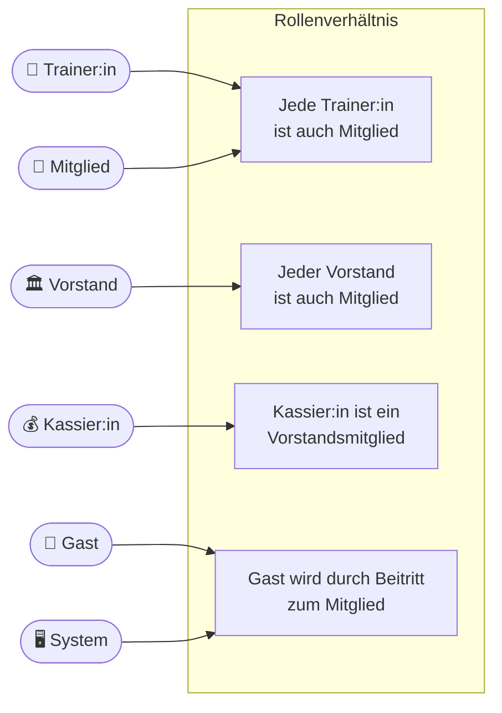
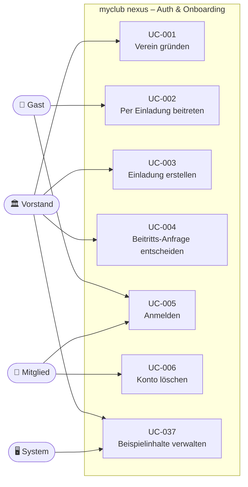
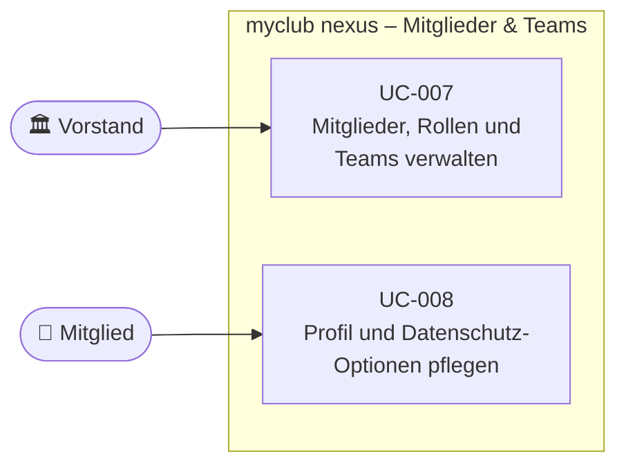
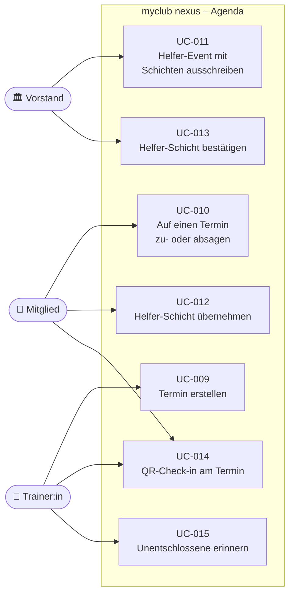
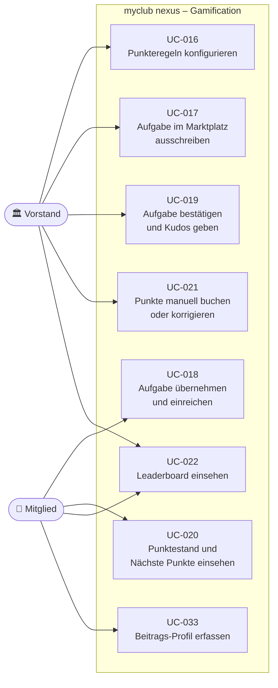
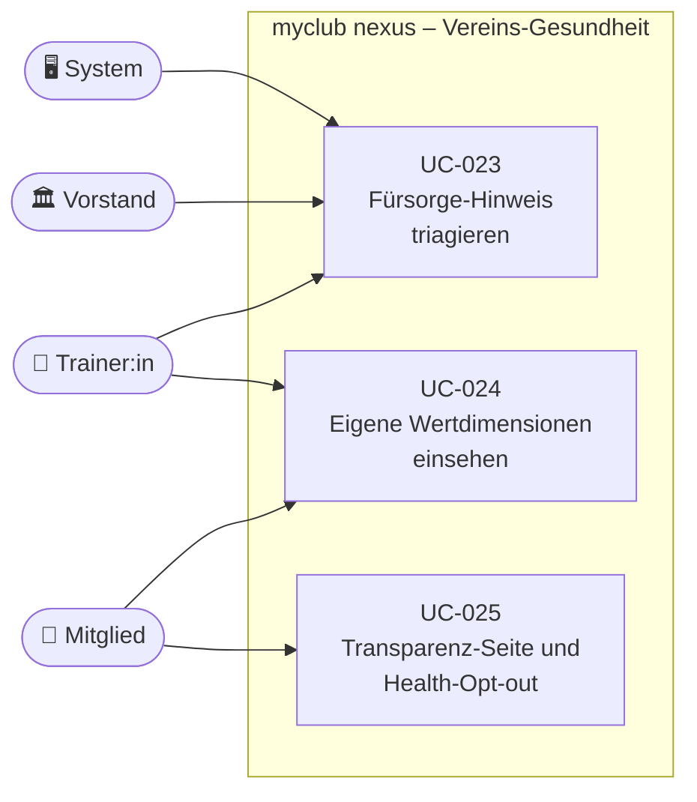
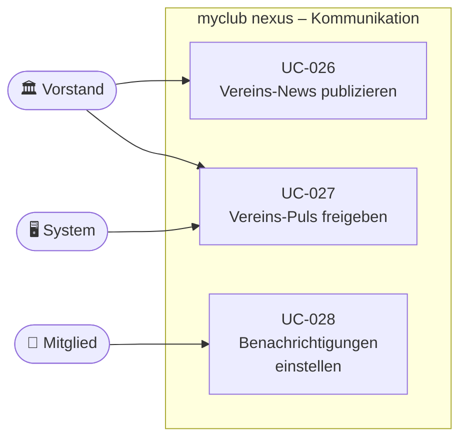
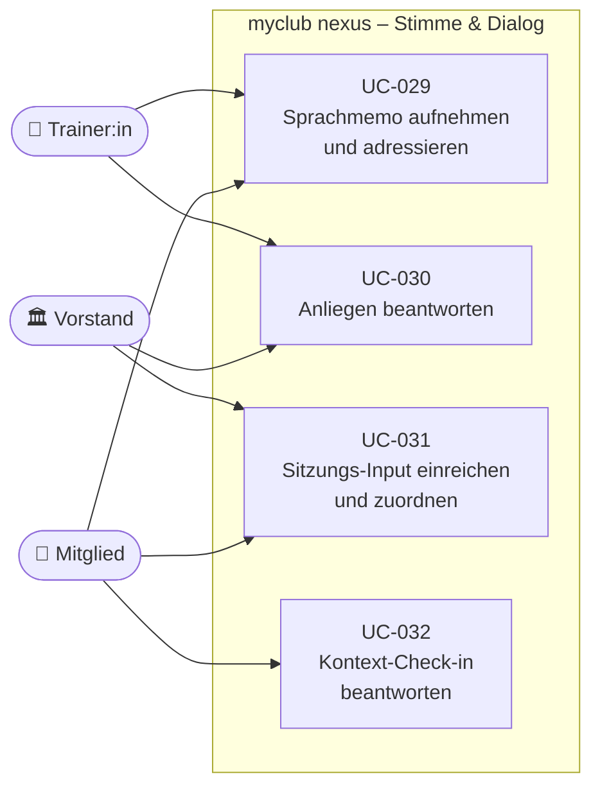
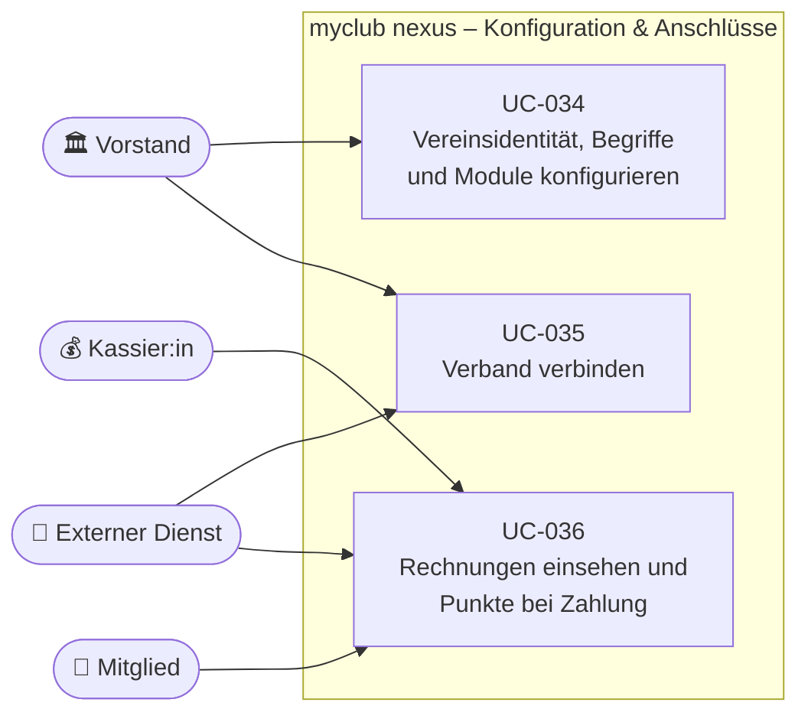

# Use Cases Overview

Übersicht der Akteure und ihrer Anwendungsfälle. Jeder Anwendungsfall ist in
[`use_cases/`](use_cases/) einzeln spezifiziert; die Zuordnung zu den Anforderungen steht im
[Index](use_cases/README.md).

Die Diagramme sind nach Fachbereichen getrennt, damit sie lesbar bleiben. Die IDs sind über das
gesamte Projekt hinweg eindeutig.

---

## Akteure

---

## 1. Auth & Onboarding

---

## 2. Mitglieder & Teams

---

## 3. Agenda

---

## 4. Gamification

---

## 5. Vereins-Gesundheit

---

## 6. News, Puls & Benachrichtigungen

---

## 7. «Stimme» & Dialog

---

## 8. Konfiguration & Anschlüsse

---

## Nicht im Diagramm

Die im Anforderungskatalog mit dem Status `Deferred` geführten Anforderungen (FR-122 bis FR-133:
Badges, Level, Challenges, Rewards, Funktionärsämter, Meisterschaft, Eltern und Kinder, Exporte,
Bulk-Import, Kalender-Publishing) sind bewusst nach dem MVP eingeplant und haben deshalb noch
keinen Anwendungsfall.
